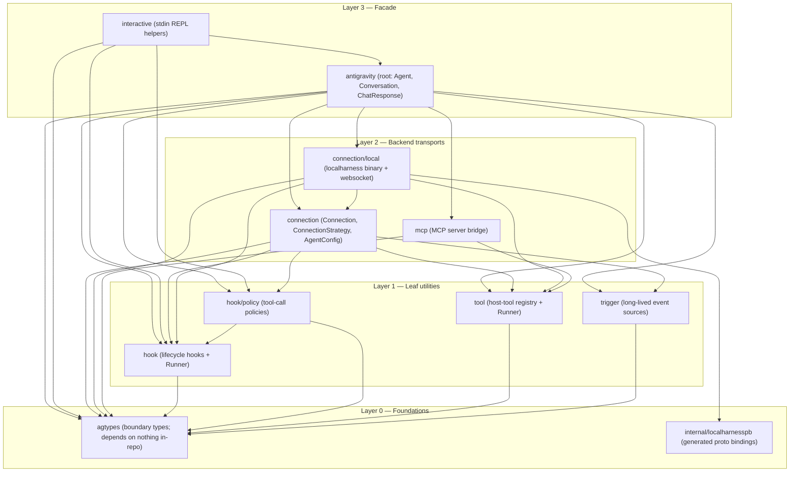
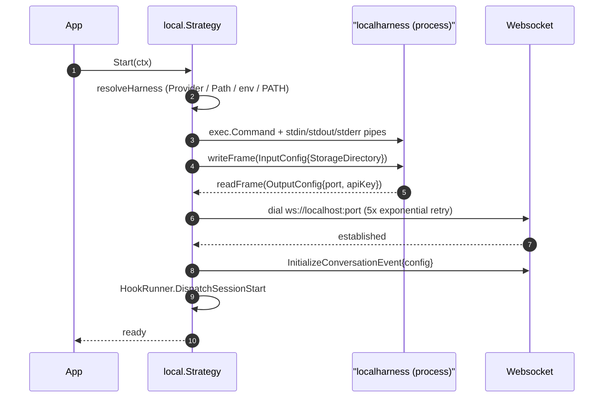
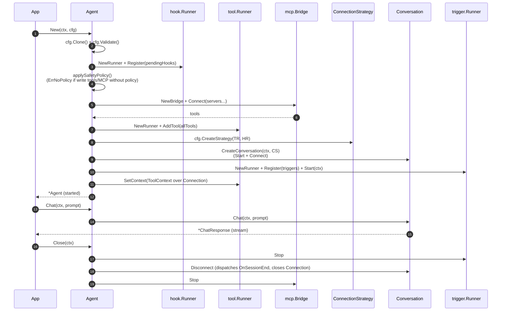
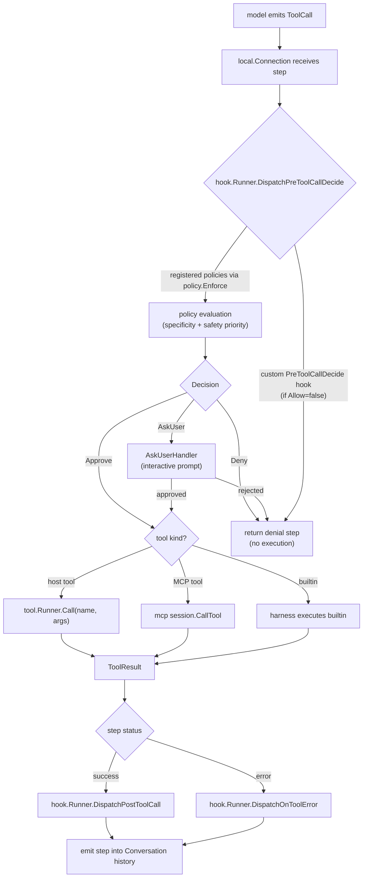

# Architecture

`antigravity-sdk-go` is a Go SDK for building AI agents on Google Antigravity
and Gemini. It is a port of
[google-antigravity/antigravity-sdk-python](https://github.com/google-antigravity/antigravity-sdk-python);
the upstream Python SDK is the source of truth for the public API surface and
semantics. The project is alpha, tracks upstream `main`, and uses Go 1.26.

This document describes the SDK's internal layering and the contracts each
layer exposes. It covers ten topics: the layer map, the type foundation, the
four leaf utilities, the connection layer and its only built-in backend, the
MCP bridge, the agent lifecycle, tool-call dispatch, the wire protocol with
the localharness binary, the concurrency model, and the extension points. For
a symbol-by-symbol mapping against the upstream Python package — including
every deliberate gap and rename — see [`PARITY.md`](../PARITY.md).

## 1. Layer map

The SDK is organized as a strict dependency hierarchy with no cycles. Each
layer depends only on layers below it, and the ordering inside a layer is
alphabetical, not topological.



The hierarchy is non-negotiable: it solves three concrete problems that come
up when porting from a duck-typed Python design to a statically-typed Go one.

- **Type isolation.** `agtypes` is the dependency root because both the root
  `antigravity` package (which defines `Agent`, `Conversation`,
  `ChatResponse`) and the `connection` package need to reference the same
  boundary types. If those types lived in either package, the other would
  have to import it — and `connection` is in turn imported by `antigravity`,
  which would create a cycle. Pushing the types into `agtypes` breaks that
  cycle by construction.
- **Accept-interfaces idiom.** Each Layer 1 leaf that needs a slice of a
  Connection (`tool.conn`, `trigger.notifier`) declares its own narrow
  interface rather than importing `connection.Connection`. The concrete
  `*LocalConnection` satisfies all of them structurally, but the leaves do
  not need to be re-compiled when the `Connection` interface grows.
- **Internal-only proto.** `internal/localharnesspb` is reachable only from
  `connection/local`. The Go visibility rules guarantee that the generated
  proto types — which are an implementation detail of the wire protocol —
  cannot leak into the public API.

## 2. Type foundation (`agtypes`)

`agtypes` defines every type that crosses an SDK API boundary. The package
imports nothing else from this repository; it is the dependency root.

The contents fall into seven groups:

| File             | Types                                                                                         |
|------------------|-----------------------------------------------------------------------------------------------|
| `config.go`      | `GeminiConfig`, `ModelConfig`, `ModelEntry`, `GenerationConfig`, `CapabilitiesConfig`, `SystemInstructions` and its variants |
| `content.go`     | `Content`, `ContentPrimitive`, `Media`, `Image`, `Document`, `Audio`, `Video`, `FromFile`     |
| `enums.go`       | `ThinkingLevel`, `BuiltinTools`, `StepType`, `StepSource`, `StepTarget`, `StepStatus`, `TriggerDelivery`, `FileChangeKind` |
| `errors.go`      | `ConnectionError`, `ValidationError`                                                          |
| `hooks.go`       | `HookResult`, `AskQuestionOption`, `AskQuestionEntry`, `AskQuestionInteractionSpec`, `QuestionResponse`, `QuestionHookResult` |
| `step.go`        | `Step`, `UsageMetadata`                                                                       |
| `tools.go`       | `ToolCall`, `ToolResult`                                                                      |
| `response.go`    | `StreamChunk`, `Thought`, `Text`, `FileChange`, `ChatChunk`                                   |

Three porting conventions are essential to understand the rest of the SDK.

### Sum types are sealed interfaces

A Python `T | U` union becomes a Go interface with an unexported marker
method:

- `StreamChunk` — implemented by `Thought` and `Text` (model output chunks).
- `SystemInstructions` — implemented by `CustomSystemInstructions` (full
  replacement of the system prompt) and `TemplatedSystemInstructions` (which
  appends `SystemInstructionSection` values to the default instructions).
- `McpServerConfig` — implemented by `McpStdioServer`, `McpSseServer`, and
  `McpStreamableHTTPServer`.
- `Media` — implemented by `Image`, `Document`, `Audio`, `Video`. Each
  implements `MIME()`, `Desc()`, and `Bytes()`, plus an `isMedia()` marker.
  Constructors `NewImage`, `NewDocument`, `NewAudio`, `NewVideo` return
  `(T, error)`; `FromFile(path, desc)` dispatches by extension.

The marker method is unexported to `agtypes`, so the implementation set is
closed at compile time. Two type aliases relax the sum-type constraint:
`ContentPrimitive = any` (documented to be `string` or `Media`) and `Content
= any` (documented to be `ContentPrimitive` or `[]ContentPrimitive`).
`ChatChunk = any` is a similar documented union covering `StreamChunk` and
`ToolCall`.

### Validators are explicit

Pydantic `model_validator(mode="after")` maps either to a `Validate() error`
method on the receiver (in place) or a constructor that returns `(T, error)`.
The Go zero value is never silently coerced — for example,
`agtypes.NewModelEntry("gemini-3.1-pro-preview")` makes the implicit
"bare-string-becomes-ModelEntry" coercion explicit. The default model is
`gemini-3.5-flash`, and the default image-generation model is
`gemini-3.1-flash-image-preview`; both are exposed as `DefaultModel` and
`DefaultImageGenerationModel` constants.

### `CapabilitiesConfig.ActiveBuiltinTools` resolution

`CapabilitiesConfig` carries `EnabledTools` and `DisabledTools` slices that
are mutually exclusive. The canonical resolution is in
`ActiveBuiltinTools()`:

- If `EnabledTools` is non-nil, return its clone (allowlist).
- Else if `DisabledTools` is non-nil, return `AllTools()` minus the denied
  set.
- Else, return `AllTools()`.

Both the connection layer (when advertising tools to the harness) and the
Agent's safety-policy guard (when deciding whether write tools are
enabled) call this method, so the resolution is identical in both places.

### `Step` with `Extra`

`Step` is the most-handled type in the SDK. Upstream uses Pydantic
`extra="allow"`; the Go port preserves that with `Extra map[string]any` and
`json:",inline"`. The local connection layer stashes its private fields
there under documented keys (`cascade_id`, `trajectory_id`, `wire_target`,
`http_code` — defined in `connection/local/step.go`), so any consumer can
read them as `step.Extra["cascade_id"]` without depending on
`connection/local`. The local backend also extends `Step.Extra` for
LocalConnection-specific data that is not promoted to named fields.

### `internal/localharnesspb`

The generated protobuf bindings for the wire protocol. They use the opaque
builder API (`pb.X_builder{...}.Build()`) rather than struct literals, which
is the runtime contract enforced by the proto generator the upstream uses.
Bindings are derived from the upstream `localharness_pb2.py` blob
`b51c2f3` — the `.proto` source is not in the upstream repo. The package
is internal: nothing outside `connection/local` may import it.

## 3. Leaf utilities

### `hook`

`hook` defines the lifecycle hook taxonomy and the `Runner` that dispatches
events to them. Each concrete hook is a typed function value rather than a
class hierarchy: Go function types are the natural analog of upstream's
decorator-wrapped callables, and each hook has a single fixed data type. All
hook types satisfy the sealed `Hook` interface, so a single `Runner.Register`
call accepts any hook and routes it by dynamic type.

#### Hook kinds

Nine hook kinds are defined, falling into three families:

| Kind                 | Family    | Signature                                                                                  |
|----------------------|-----------|---------------------------------------------------------------------------------------------|
| `OnSessionStart`     | Inspect   | `func(ctx, *Context) error`                                                                |
| `OnSessionEnd`       | Inspect   | `func(ctx, *Context) error`                                                                |
| `PreTurn`            | Decide    | `func(ctx, *Context, prompt agtypes.Content) (agtypes.HookResult, error)`                  |
| `PostTurn`           | Inspect   | `func(ctx, *Context, response string) error`                                               |
| `PreToolCallDecide`  | Decide    | `func(ctx, *Context, call agtypes.ToolCall) (agtypes.HookResult, error)`                   |
| `PostToolCall`       | Inspect   | `func(ctx, *Context, result agtypes.ToolResult) error`                                     |
| `OnToolError`        | Transform | `func(ctx, *Context, toolErr error) (replacement any, handled bool, err error)`            |
| `OnInteraction`      | Transform | `func(ctx, *Context, spec agtypes.AskQuestionInteractionSpec) (result agtypes.QuestionHookResult, handled bool, err error)` |
| `OnCompaction`       | Inspect   | `func(ctx, *Context, data any) error`                                                      |

Inspect hooks are read-only and non-blocking (observability). Decide hooks
are read-only but blocking (policy). Transform hooks may mutate the data
being inspected (the error a model sees, the user's answer to a question).

`OnToolError` and `OnInteraction` follow a `(value, handled, error)` triple
convention: returning `handled=false` signals that the hook did not handle
the event and the next hook (or the harness's default formatting) should
take over.

#### Hook contexts

`hook.Context` is the state-carrying object passed to every hook. Contexts
form a three-level chain — session → turn → operation — created by
`NewSessionContext`, `NewTurnContext(session)`, and
`NewOperationContext(turn)`. `Get` walks toward the root searching every
level; `Set` writes only to the local context's store. A `Context` is not
safe for concurrent use; within a single dispatch all hooks run
sequentially.

The Runner owns the session context (`runner.SessionContext()`). The local
connection creates a turn context inside `DispatchPreTurn` and stashes it as
`currentTurnCtx` until `DispatchPostTurn` runs. Tool-call hooks receive an
operation context parented to the turn context, so a `PostToolCall` hook can
read state a `PreToolCallDecide` hook recorded on the same operation.

#### Escape hatch for the safety guard

`Runner.HasPreToolCallDecide` is the escape hatch for the safety-policy
guard in the `Agent` (see §6). A user who registered any `PreToolCallDecide`
hook is presumed to be gating tool calls themselves, so `ErrNoPolicy` is not
raised.

### `hook/policy`

`policy` is a declarative tool-call rule system enforced through the hook
layer. A `Policy` expresses APPROVE, DENY, or ASK_USER for a tool name (or
the `"*"` wildcard), optionally guarded by a `Predicate` over the call. A
`Policy.Name` provides a human-readable label that appears in logs and deny
messages.

#### Priority and short-circuiting

Multiple policies are sorted into six priority buckets:

```
specific deny > specific ask > specific allow >
wildcard deny > wildcard ask > wildcard allow
```

`policy.Enforce` pre-sorts policies into these buckets at compile time so
the returned hook short-circuits on the first match within the highest
non-empty bucket. Within a bucket the first match wins.

#### Fail-closed evaluation

The compiled hook fails closed in three ways:

- **Validation up-front.** `Enforce` rejects any `AskUser` policy that lacks
  a handler, returning an error joined with `ErrMissingAskUserHandler`. The
  failure happens at compile time, not at the first call.
- **Predicate errors deny.** If a `Predicate` returns an error, the policy
  evaluation logs the error and produces a denying `HookResult` naming the
  policy. The error is never propagated up the call chain — the model sees
  a deny.
- **Panics deny.** A panic in any `Predicate`, `AskUser` handler, or apply
  step is recovered, logged, and converted into a denying `HookResult`.
  The hook never panics on its caller.

When no policy matches, the hook allows the call (the default-open
behavior, since `WorkspaceOnly` and `ConfirmRunCommand` are themselves
opt-in policies prepended by the local config).

#### Pre-built rule sets

- `AllowAll()` — approve every call.
- `DenyAll()` — deny every call; combine with specific `Allow` policies for
  a deny-by-default posture (specific outranks wildcard).
- `SafeDefaults(handler)` — approve read-only tools, ask the user for any
  other tool.
- `ConfirmRunCommand(handler)` — deny `run_command` (or ask, if `handler`
  is non-nil), approve everything else. This is the default the local
  backend installs when `Policies` is unset.
- `WorkspaceOnly(workspaces)` — deny any file tool whose
  `ToolCall.CanonicalPath` resolves outside the listed directories. The
  local backend always prepends this set when `Workspaces` is non-empty.

#### Path containment (`policy/path.go`)

`IsPathInWorkspace` is shared by `WorkspaceOnly` and any user-defined
predicate. Both paths are canonicalized (made absolute and
symlink-resolved) before comparison via `filepath.Rel`. Three properties
matter:

- **`..` rejection on the raw input.** A target containing any `..` segment
  is rejected outright, before `filepath.Abs`/`filepath.Clean` can lexically
  cancel a `symlink/..` pair and hide a traversal from symlink resolution.
  Both `filepath.ToSlash(path)` and `path` are scanned so a `\` separator on
  Windows is caught.
- **Strict workspace existence.** The workspace must exist on disk;
  resolution failures yield a `false` containment result. A target's longest
  existing ancestor is resolved with `EvalSymlinks`, then the cleaned
  not-yet-created tail is re-appended — mirroring upstream's
  `resolve(strict=False)`.
- **Case-insensitive FS heuristic.** On macOS and Windows the comparison
  is lowered before `Rel` evaluation. The check keys off `runtime.GOOS`
  rather than per-path stat probes, erring toward over-restriction on the
  rare case-sensitive volume on those platforms — the safe direction for
  a security policy.

A TOCTOU race remains (a path validated here could be replaced by a symlink
before the tool acts on it). This limitation is shared with the upstream
SDK and is not defended against here.

### `tool`

`tool` is the in-process tool registry. The package's central type is
`Tool`, the function value:

```go
type Tool func(ctx context.Context, args map[string]any) (any, error)
```

`ToolWithSchema` pairs it with `Name`, `Description`, and `InputSchema`
(JSON Schema). The `Runner` indexes tools by name, and connections use the
schema when advertising the tool to the model.

#### `ToolContext` injection

A `ToolContext` carrying conversation capabilities is injected through
`context.Context` so tools can retrieve it with `tool.FromContext`:

```go
func myTool(ctx context.Context, args map[string]any) (any, error) {
    tc, ok := tool.FromContext(ctx)
    if !ok { /* no capabilities available */ }
    return nil, tc.Send(ctx, "follow-up message")
}
```

The `Runner` calls `WithToolContext(ctx, r.tc)` on each invocation so every
tool sees the same `ToolContext`. The `ToolContext` itself wraps a narrow
`conn` interface (just `ConversationID`, `IsIdle`, `SendTriggerNotification`)
plus a `sync.RWMutex`-guarded `state` map for per-conversation key/value
storage shared across tools.

#### Concurrent dispatch

`Runner.ProcessToolCalls` fans the input calls into goroutines via
`sync.WaitGroup.Go`, collects each result in its input position, and waits
for the batch to complete. Unknown tools and tool errors become a
`ToolResult` with `Error` populated and `Exception` carrying the Go error
value — the batch never fails as a unit.

#### Typed tools

`tool.Typed(fn, name, description)` is the helper for statically-typed
tool bodies:

```go
type AddArgs struct {
    A, B int `json:"a"`
}
ts := tool.Typed(func(ctx context.Context, a AddArgs) (int, error) {
    return a.A + a.B, nil
}, "add", "Sum two integers.")
```

`Typed` reflects over the argument type, generates a JSON Schema, and
produces a `ToolWithSchema` whose `Fn` decodes the `map[string]any` into
`T`, calls the typed function, and returns the result. Callers who need
full control over the schema can construct a `ToolWithSchema` literal
instead.

### `trigger`

`trigger` exposes long-lived event sources that run alongside an agent
session and push messages into the conversation. A `Trigger` is:

```go
type Trigger func(ctx context.Context, tc *Context) error
```

It runs until `ctx` is cancelled, calling `tc.Send` to deliver messages.
The package's `Runner` starts each registered trigger as its own goroutine
at session start (one goroutine per trigger) and cancels them all at
session end.

The `Context` (a separate type from `hook.Context`) holds a narrow
`notifier` interface containing only `SendTriggerNotification`. The full
`connection.Connection` satisfies it structurally, so the `trigger` package
depends on `agtypes` and the standard library, never on `connection`. A
conformance test in the package guarantees this remains true.

Two helpers cover the common cases:

- `Every(interval, callback)` — fires `callback` once per interval. The
  first invocation is delayed by `interval` (not immediate), matching the
  upstream behavior. Panics if `interval <= 0`.
- `OnFileChange(path, callback)` — watches `path` (recursively when it is
  a directory) and invokes `callback` on each event with one or more
  `agtypes.FileChange` values. File watching uses
  [`fswatcher`](https://github.com/fswatcher/fswatcher), so the dependency
  is always present — the upstream lazily imports `watchfiles`. Raw
  `fswatcher.Op` flags are translated: `Create` → `FileChangeAdded`,
  `Remove`/`Rename` → `FileChangeDeleted`, everything else
  (`Write`/`Chmod`) → `FileChangeModified`.

## 4. Connection layer

The `connection` package defines transport-agnostic interfaces; concrete
backends live in subpackages. `connection/local` is the only built-in
backend and talks to the upstream `localharness` binary over a websocket.

### Interfaces

`Connection` is the SDK's public handle on a live agent session. The
interface has 11 methods:

- **State**: `IsIdle`, `ConversationID`.
- **Sending**: `Send`, `SendToolResults`, `SendTriggerNotification`.
- **Receiving**: `ReceiveSteps` (returns `iter.Seq2[agtypes.Step, error]`).
- **Lifecycle**: `Disconnect`, `Cancel`, `Delete`.
- **Idle coordination**: `SignalIdle`, `WaitForIdle`, `WaitForWakeup`.

`BaseConnection` is an embeddable struct that provides no-op defaults for
every optional method (`IsIdle`, `ConversationID`, `Disconnect`, `Cancel`,
`Delete`, `SignalIdle`, `WaitForIdle`, `WaitForWakeup`, `SendToolResults`).
It deliberately does **not** implement `Send`, `ReceiveSteps`, or
`SendTriggerNotification`: those have no sensible default, so an embedding
type must supply them — and the compiler enforces this when the type is
used as a `Connection`.

`ConnectionStrategy` knows how to bring a backend up (`Start`), hand out a
`Connection` (`Connect`), and tear it down (`Close`). This is the Go analog
of upstream's `async with` lifecycle. `Connect` returns
`ErrNotStarted` if called before `Start`.

`AgentConfig` carries the user's configuration and produces a strategy via
`CreateStrategy(toolRunner, hookRunner)`. It is an interface with three
groups of methods: getters for the shared configuration (12 of them),
setters used by the `Agent` (`SetCapabilities`, `SetPolicies`), and
lifecycle (`CreateStrategy`, `Clone`, `Validate`).

### `BaseAgentConfig` contract

The `BaseAgentConfig` struct holds the fields shared by every backend:

| Field                | Type                          | Purpose                                                       |
|----------------------|-------------------------------|---------------------------------------------------------------|
| `SystemInstructionsValue` | `agtypes.SystemInstructions` | Override/augment the default system prompt                    |
| `CapabilitiesValue`  | `agtypes.CapabilitiesConfig`  | Tool exposure and subagent settings                           |
| `ToolsValue`         | `[]tool.ToolWithSchema`       | Host-side custom tools                                        |
| `PoliciesValue`      | `[]policy.Policy`             | Tool-call policies                                            |
| `HooksValue`         | `[]hook.Hook`                 | Lifecycle hooks                                               |
| `TriggersValue`      | `[]trigger.Trigger`           | Long-lived event sources                                      |
| `MCPServersValue`    | `[]agtypes.McpServerConfig`   | MCP servers to bridge in                                      |
| `WorkspacesValue`    | `[]string`                    | Workspace directories                                         |
| `ConversationIDValue`| `string`                      | Resume an existing conversation when set                      |
| `SaveDirValue`       | `string`                      | Where conversation state is persisted                         |
| `AppDataDirValue`    | `string`                      | Application data directory                                    |
| `ResponseSchemaValue`| `string`                      | JSON-schema for structured output                             |
| `SkillsPathsValue`   | `[]string`                    | Paths to skill definitions                                    |

Concrete configs embed `BaseAgentConfig` and add backend-specific fields.
Two contracts on `AgentConfig` are subtle:

- **`Clone()` is deep — but with a documented carve-out.** The `Agent` deep
  copies the config at start time so later mutations of the caller's value
  do not affect the running session. Value fields are deep-copied; the
  `hooks`, `triggers`, and `tools` slices are copied shallowly so the
  identity of user-provided callbacks is preserved. This mirrors upstream's
  `model_copy(deep=True)` plus original-list snapshot.
- **`Validate()` is idempotent.** Backends apply their defaults and
  validators inside `Validate()`. The `Agent` calls it during construction
  (see §6) so a config passed directly to `New` is fully configured even
  when the caller did not invoke a backend `Build()` first. Concrete configs
  guard against re-running side-effectful steps (the local backend uses a
  private `validated` flag to avoid re-prepending workspace policies).

### Local backend (`connection/local`)

The local backend has six concerns: process management (`strategy.go`),
binary resolution (`binary.go`), the handshake (`framing.go`, `strategy.go`),
the live websocket connection (`connection.go`, `reader.go`), step parsing
(`step.go`, `types.go`), and the config layer (`config.go`).

#### Binary resolution

`Strategy.Start` resolves the `localharness` binary by checking, in order:

1. `HarnessProvider`, if set — a callback that returns the path plus a
   cleanup. Used for `//go:embed`ed binaries; see §10.
2. `AgentConfig.HarnessPath`, if non-empty.
3. The `ANTIGRAVITY_HARNESS_PATH` environment variable.
4. `exec.LookPath("localharness")`.

A failure to locate the binary returns `ErrBinaryNotFound` whose message
enumerates all four resolution sources, so the user sees exactly what to
set.

#### Handshake

The handshake exchanges two protobuf messages over the harness's
stdin/stdout pipes using length-prefixed framing (`framing.go`):



The websocket dial uses a 5-attempt exponential backoff with a 100 ms base
delay (`100 ms`, `200 ms`, `400 ms`, `800 ms`, then `1.6 s` between retries)
because the harness may not be listening immediately after emitting its
`OutputConfig`. The dial includes the harness-issued API key in an
`x-goog-api-key` header.

Stderr is captured to a bounded 100-line ring buffer (`stderrBuffer`) drained
by a background goroutine. On any handshake failure the harness is killed
and the buffer's tail is appended to the returned error so the user sees the
harness's diagnostic output without it being lost to a closed pipe.

#### Reader loop and event dispatch

A single `readerLoop` goroutine consumes the websocket and dispatches on
`OutputEvent`'s `which` discriminator. Three event kinds are handled:

| Event                    | Handler                          | Behavior |
|--------------------------|----------------------------------|----------|
| `StepUpdate`             | `handleStepUpdate`               | Update step tracker, parse into `agtypes.Step`, push to `stepCh`, fire `OnCompaction` if applicable, fire deferred `PostToolCall`/`OnToolError` for previously-approved builtin calls, dispatch wait-state requests. |
| `TrajectoryStateUpdate`  | `handleTrajectoryStateUpdate`    | Track parent/subagent running/idle transitions; fire `PostToolCall` for a completed subagent (`start_subagent`); signal connection idle when parent is idle and no subagents remain active. |
| `ToolCall`               | `handleToolCall` (background)    | Execute a host-side tool: enqueue a tool-call step, run `PreToolCallDecide` (deny→error result), execute via `tool.Runner.ProcessToolCalls`, run `PostToolCall` or `OnToolError`, send the result back via `SendToolResults`. |

The reader's terminal behavior depends on context. An expected close
(during `Disconnect`) is silent. A websocket close from the harness side
becomes a `ConnectionError` whose message includes the close code and the
captured stderr tail. Any other read error becomes a `ConnectionError`
wrapping the underlying cause.

#### Step parsing (`step.go`)

`stepFromUpdate` translates a `StepUpdate` proto into an `agtypes.Step`,
performing several normalizations:

- **Step ID synthesis.** The step id is `trajectoryID:stepIndex` (or bare
  `stepIndex` when the trajectory id is empty), matching upstream.
- **Builtin action detection.** A `StepUpdate` carries at most one builtin
  action (oneof on the proto). `activeAction` enumerates the 10 actions
  (`create_file`, `edit_file`, `find_file`, `list_directory`, `run_command`,
  `search_directory`, `view_file`, `invoke_subagent`, `generate_image`,
  `finish`) and returns the name plus the action message.
- **Argument extraction.** The action message is rendered to a
  `map[string]any` via `protojson.MarshalOptions{UseProtoNames: true}` →
  `gojson.Unmarshal`. The intermediate JSON preserves proto field names
  (snake_case) so policy predicates see the same key names as upstream.
- **Canonical path normalization.** A subset of argument keys (`path`,
  `file_path`, `TargetFile`, `directory_path`) is treated as filesystem
  paths and normalized: a `file://` URL becomes its percent-decoded
  `Path` component; anything else passes through. The chosen path is
  stored as `ToolCall.CanonicalPath` so the workspace policy can evaluate
  it.
- **Extra-key promotion.** `cascade_id`, `trajectory_id`, `wire_target`,
  and `http_code` are stashed into `Step.Extra` under the named constants
  exported by `connection/local`.

#### Wait-state debouncing (`stepTracker`)

The harness may rebroadcast a `WAITING_FOR_USER` step until the SDK
responds. Each step has a `stepTracker` recording the state transitions
and the set of wait-state request kinds (`questions_request`,
`tool_confirmation_request`) for which the SDK has already begun handling.
`markHandled` returns `true` only the first time a request kind is seen,
so duplicate broadcasts do not trigger duplicate hook dispatches.

#### Builtin tool output types

The structured results of builtin tool executions are extracted from the
per-action fields of a `StepUpdate` and exposed as concrete Go types
implementing the sealed `ToolOutput` interface:

| Builtin           | Result type                | Notes |
|-------------------|----------------------------|-------|
| `run_command`     | `RunCommandResult`         | `Output` field |
| `list_directory`  | `ListDirectoryResult`      | Each entry is a `ListDirectoryEntry{Name, IsDirectory, FileSize}`; `String()` renders one entry per line |
| `search_directory`| `SearchDirectoryResult`    | Count of matches |
| `find_file`       | `FindFileResult`           | Output text |
| `edit_file`       | `EditFileResult`           | Diff summary |
| `generate_image`  | `GenerateImageResult`      | Generated image name |
| anything else     | `TextResult`               | Generic fallback (e.g. `view_file`) |

These values flow into `ToolResult.Result` for `PostToolCall` hooks and are
JSON-encoded when sent over the wire as `ToolResponse`.

#### `local.AgentConfig` and `Validate`

The local config adds `GeminiConfig`, `Model` and `APIKey` shorthands,
`HarnessPath`, and `HarnessProvider`. `Validate` (called via `Build` or
automatically by the Agent) applies:

1. **Shorthand folding.** `Model` → `GeminiConfig.Models.Default.Name` (error
   if both set); `APIKey` → `GeminiConfig.APIKey` (error if both set).
2. **Default models.** If `GeminiConfig.Models.Default.Name` is empty, it is
   set to `agtypes.DefaultModel`. If `Capabilities.ImageModel` is empty, the
   full `DefaultCapabilitiesConfig` is installed.
3. **Default workspace.** When `Workspaces` is nil, the current directory is
   used.
4. **AppDataDir validation.** Must be an absolute path when set;
   otherwise a `ValidationError` is returned.
5. **Default policies.** When `Policies` is nil, `ConfirmRunCommand(nil)` is
   installed (deny `run_command`, allow everything else).
6. **Workspace policy prepend.** When `Workspaces` is non-empty, the app
   data directory (defaulting to `~/.gemini/antigravity`) is added to the
   allowlist and `policy.WorkspaceOnly(allowlist)` is **prepended** to
   `Policies` so file tools are always sandboxed regardless of what other
   policies the user adds.

A private `validated` flag guards against re-prepending workspace policies
on a second call.

## 5. MCP bridge (`mcp`)

`mcp.Bridge` connects to one or more Model Context Protocol servers over
stdio, SSE, or streamable HTTP, discovers the tools each server advertises,
and adapts each into a `tool.ToolWithSchema` whose `Fn` forwards the call to
the originating session. The `Agent` registers these tools alongside
host-side tools at startup.

The bridge is built on the official
[modelcontextprotocol/go-sdk](https://github.com/modelcontextprotocol/go-sdk),
not a hand-rolled client. The flow is:

1. **Transport dispatch.** `Connect` dispatches on the
   `agtypes.McpServerConfig` sum-type variant:
   - `McpStdioServer` → `CommandTransport{Command: exec.Command(c.Command, c.Args...)}`
   - `McpSseServer` → `SSEClientTransport{Endpoint: c.URL}`
   - `McpStreamableHTTPServer` → `StreamableClientTransport{Endpoint: c.URL}`
   - Any other type → an error naming the dynamic type.
2. **Session establishment.** A single `mcpsdk.Client` is reused across all
   connections; each `Connect(ctx, transport, nil)` yields a session that
   is appended to `b.sessions`.
3. **Tool discovery.** After connecting, `ListTools(ctx, nil)` enumerates
   every tool the server advertises. Each tool's `InputSchema` (typed as
   `any` in the MCP SDK because it's a JSON Schema value) is normalized
   into `map[string]any` by `schemaToMap`: a direct cast first, falling
   back to JSON marshal+unmarshal so types from any source converge.
4. **Adapter generation.** Each discovered tool becomes a
   `tool.ToolWithSchema` whose `Fn` calls `session.CallTool(ctx,
   {Name, Arguments})`. The result handling prefers `res.StructuredContent`
   over text — only when it is nil does the adapter concatenate all
   `TextContent` items into a string via `contentText`.

`Stop` closes every active session, retaining the first close error to
return. The Agent calls it during `teardown`.

## 6. Agent lifecycle

`Agent` is the Layer 3 entry point. It owns a configured session: a
connection, a conversation, hook/tool/trigger runners, and an optional MCP
bridge. Construct one with `New(ctx, config)`, drive it with `Chat` (or the
`Conversation()` accessor), and release it with `Close`.



### `NewAgent` vs `New`

`NewAgent(config)` returns an unstarted Agent. It does three things:

1. `config.Clone()` to take ownership.
2. If `ResponseSchema` is set on the clone, copy it into
   `Capabilities.FinishToolSchemaJSON` and write the capabilities back via
   `SetCapabilities`.
3. Snapshot `Hooks()` and `Triggers()` from the clone into private
   `pendingHooks` / `pendingTriggers` slices.

`New(ctx, config) = NewAgent(config).Start(ctx)`. The caller chooses
between them: `New` is the one-step form; `NewAgent`+`Start` lets the
caller register additional hooks via `RegisterHook` before starting.

### `Start` ordering

`Start` runs a strictly ordered sequence and is **not retryable** — pending
hooks and triggers are consumed on the first call:

1. `config.Validate()` (returns its `*ValidationError` directly).
2. `hookRunner = hook.NewRunner()`; register pending hooks.
3. `applySafetyPolicy()`:
   - Build a set of read-only builtins.
   - Compute `hasWriteTools` from `Capabilities.ActiveBuiltinTools()`.
   - Compute `hasMCP` from `MCPServers()`.
   - If write tools or MCP servers are enabled, and `Policies()` is empty,
     and no `PreToolCallDecide` hook is registered, return `ErrNoPolicy`.
   - Otherwise, if any policies are set, compile them with
     `policy.Enforce` and register the resulting hook.
4. **From here on, any failure triggers `teardown(ctx)` via a deferred
   func.** Partially-built state never escapes.
5. Connect MCP servers (if any); append their tools to the tool list.
6. `toolRunner = tool.NewRunner()`; add every tool (host + MCP).
7. `strategy = config.CreateStrategy(toolRunner, hookRunner)`.
8. `CreateConversation(ctx, strategy)` — `strategy.Start` + `Connect`.
9. If pending triggers exist: `triggerRunner = trigger.NewRunner(conv.Connection())`;
   register; `Start`.
10. `toolRunner.SetContext(tool.NewToolContext(conv.Connection()))` so host
    tools see the `ToolContext`.
11. `started.Store(true)`.

`RegisterHook` is allowed at any time — before `Start` it appends to
`pendingHooks` under a mutex; after `Start` it forwards to
`hookRunner.Register`. `RegisterTrigger` returns `ErrAgentStarted` after
`Start` because triggers cannot be added once the trigger runner has been
spun up.

### `Close` ordering

`Close` calls `teardown(ctx)`, which reverses startup:

1. Stop the trigger runner if any (cancels all trigger goroutines).
2. `conversation.Disconnect(ctx)` — see §9 for the harness shutdown
   sequence, which itself dispatches `OnSessionEnd` and closes the
   websocket.
3. `mcpBridge.Stop()` if any.
4. `started.Store(false)`.

Errors from each step are accumulated and joined via `errors.Join`. `Close`
is safe on a partially-started agent (each step checks for nil).

### `Conversation`

`Conversation` wraps a single agent session. It accumulates step history,
tracks per-turn start and compaction indices, aggregates token usage, and
exposes both step- and chunk-level iterators. The default history cap is
10,000 steps (`DefaultMaxHistorySize`); when exceeded the oldest steps are
discarded and the per-turn indices are shifted to remain valid. A cap of 0
disables trimming.

> **Single-active-iterator invariant.** Only one stream iteration
> (`ReceiveSteps`, `ReceiveChunks`, or the stream behind `Chat`) may be
> active at a time. The invariant exists so history accumulates exactly
> once per step. The implementation uses a private `iterating` flag
> guarded by `c.mu`:
>
> - `tryBeginIterate()` atomically reads-and-sets the flag, returning
>   `true` if the iterator was acquired.
> - `endIterate()` releases it in a `defer`.
>
> A second iteration attempted while one is active immediately yields
> `ErrIterating`. `Send` is special: when the connection is non-idle, it
> either acquires the iterator and drains the previous turn itself (calling
> `drainLockedIterator`) or, if another goroutine already holds the
> iterator, waits for the connection to go idle via `WaitForIdle`.

`recordStep` is what makes history accumulate exactly once: every step
yielded by `ReceiveSteps` flows through it before being yielded to the
caller. It appends to `c.steps`, records compaction step positions in
`c.compactionIdx`, sums `UsageMetadata` deltas into `cumulativeUsage` and
`turnUsage`, and enforces the history cap.

`ReceiveChunks` is layered on `ReceiveSteps`: it filters to
`source=MODEL`+`target=USER` steps and emits `Thought`/`Text` for
`ThinkingDelta`/`ContentDelta` plus per-step `ToolCalls`. Tool calls are
deduplicated by `ID` across the steps of one iteration (the dedup set
resets between turns); calls without an ID are always yielded.

### `ChatResponse` — multi-cursor streaming

`Chat` returns a `*ChatResponse` that wraps the turn's chunk stream with
lazy buffering. The wrapping uses `iter.Pull2`, exposing a pull-style API
on top of the push-style `iter.Seq2` returned by `ReceiveChunks`. Each of
its iterator methods (`Chunks`, `Thoughts`, `TextDeltas`, `ToolCalls`)
returns an independent cursor positioned at the start of the turn.

Cursors may be consumed sequentially or concurrently from multiple
goroutines. The mechanism:

- A single `buf []agtypes.ChatChunk` slice and a `mu sync.Mutex` guard the
  shared state.
- `at(pos)` is the cursor primitive. If `pos < len(buf)` it returns the
  buffered value under the lock — fast path, no upstream pull. Otherwise
  it pulls one value from the upstream stream under the lock and appends
  it. Concurrent cursors thus serialize on the upstream stream but never
  race on the buffer.
- Terminal state (`done`/`err`) sticks: once the upstream signals
  termination, every later cursor that reaches the live edge sees the same
  end (or terminal error). The terminal error is reported to every cursor
  that reaches the live edge after the failure.

`Resolve`, `Text`, and `StructuredOutput` drain the stream and `Close`
implicitly. Callers that take cursors but do not drain them should `Close`
the response to release the underlying `iter.Pull2` resources.

## 7. Tool-call dispatch

When the agent decides to call a tool, the request flows through the policy
and hook layers before — and after — invocation. There are three distinct
dispatch paths because the harness signals each tool kind differently:

| Tool kind | Wire event           | Decide-hook point                       | Result delivery                       |
|-----------|----------------------|-----------------------------------------|---------------------------------------|
| Builtin   | `StepUpdate` waiting on `ToolConfirmation` | `decideToolConfirmation` (sync) | Builtin runs in the harness; post-hook fires when the same step reaches DONE/ERROR (via `pendingBuiltin` tracking) |
| Host tool | `ToolCall`           | `handleToolCall` (async)                | `tool.Runner.ProcessToolCalls`; result sent via `SendToolResults` |
| MCP tool  | `ToolCall`           | same as host tool                       | `mcpsdk.ClientSession.CallTool`; result sent via `SendToolResults` |
| Subagent  | `TrajectoryStateUpdate` IDLE | (none — pre-decided when spawned) | `PostToolCall(start_subagent)` fired on idle transition with the captured subagent response |



Five properties of this pipeline are worth highlighting:

- **Policy denial is visible but rejected.** A policy-denied tool stays
  advertised to the model (so the model can learn from rejection); only
  the specific call is refused. Compare with
  `CapabilitiesConfig.DisabledTools`, which removes a tool from the
  model's context entirely.
- **Workspace scoping is path-based, not tool-based.** `WorkspaceOnly`
  denies any file tool whose `CanonicalPath` resolves outside the
  configured workspaces. If `CanonicalPath` is empty (the connection layer
  did not populate it) the call is denied — the policy fails closed.
- **`OnToolError` can rewrite errors.** A registered `OnToolError` hook
  can return a replacement value the model sees in place of the raw
  error. A return of `(replacement, true, nil)` substitutes the value and
  fires `PostToolCall` with it; `(nil, false, nil)` lets the harness's
  default formatting through.
- **Host-tool denials are reported to the harness.** When
  `PreToolCallDecide` denies a host-tool call, `handleToolCall` sends back
  a `ToolResult{Error: "Tool execution denied by hook policy: "+message}`
  so the model sees a structured failure rather than a hang.
- **Pre-request host tool short-circuit.** A harness `ToolConfirmation`
  request whose action does not match any known builtin is treated as a
  pre-request for a host tool (the call itself will arrive on a later
  `ToolCall` event). These are auto-approved with name
  `pre_request_host_tool_request` to keep the harness moving.

### Subagent completion path

A `start_subagent` call is decided at the time it is spawned (via the
standard `ToolConfirmation` path), but its completion is delivered out of
band:

1. While the subagent runs, every model step it emits whose
   `source=MODEL` is recorded in `subagentResponses[trajID]` so the
   eventual `ToolResult.Result` carries the subagent's final reply.
2. The harness emits a `TrajectoryStateUpdate{state=IDLE}` for the
   subagent's trajectory id. `handleTrajectoryStateUpdate` removes the
   trajectory from `activeSubagents` and reads the captured response.
3. `PostToolCall` fires with `Name=start_subagent` and the captured
   response (or the trajectory id, when nothing was captured).
4. The connection signals idle only when the parent is idle and every
   subagent has completed: `idleNow = parentIdle && len(activeSubagents) == 0`.

### Post-turn detection

`PostTurn` is not fired by the harness — the SDK derives the
turn-completion event from the step stream. `maybeDispatchPostTurn` fires
the hook when a step satisfies all three conditions:

- terminal status (`DONE`, `ERROR`, or `CANCELED`),
- `target=USER` on the wire (read from `Step.Extra[ExtraWireTarget]`),
- `source=MODEL`.

Other terminal steps (e.g. tool results) are not the turn's reply and do
not fire `PostTurn`.

## 8. Wire protocol

This section documents the protocol with the localharness binary in
enough detail to debug a connection or write an alternate harness. Wire
shapes live in `internal/localharnesspb`.

> **Protocol duality.** The stdin handshake uses length-prefixed
> protobuf frames (4-byte little-endian length followed by `proto.Marshal`
> body, matching upstream's `struct.pack("<I")` framing). Once the
> handshake completes, the SDK and harness exchange protojson-encoded
> events over the websocket. The two encodings intentionally do not
> overlap — the handshake is a private bootstrap protocol whose only
> purpose is to learn the websocket port and API key.

### Handshake

The handshake transfers exactly two messages:

- **`InputConfig`** (SDK → harness, stdin): carries `StorageDirectory`,
  the path where the harness should persist conversation state. The SDK
  defaults this to a fresh `os.MkdirTemp("", "antigravity_")` directory
  when `SaveDir` is unset.
- **`OutputConfig`** (harness → SDK, stdout): carries `port` (a
  port-local TCP number) and `api_key` (a per-process secret the harness
  expects on every websocket request as `x-goog-api-key`).

A failure to write `InputConfig` or read `OutputConfig` is fatal — the
SDK kills the process, captures the stderr ring buffer, and returns the
joined error.

### Websocket — input events (SDK → harness)

| Event                          | Builder              | Purpose |
|--------------------------------|----------------------|---------|
| `InitializeConversationEvent`  | `pb.InputEvent.InitializeConversation` | First message after the websocket is established; carries the harness config (system instructions, capabilities, tools, etc.) |
| `user_input` (string)          | `pb.InputEvent.UserInput` | Plain text prompt |
| `ComplexUserInput`             | `pb.InputEvent.ComplexUserInput` | Multipart prompt with text and `Media` parts |
| `tool_confirmation`            | `pb.InputEvent.ToolConfirmation` | Allow/deny a pending builtin tool call |
| `question_response`            | `pb.InputEvent.QuestionResponse` | Answer the harness's multiple-choice question |
| `tool_response`                | `pb.InputEvent.ToolResponse` | Host-tool execution result, correlated by `id` |
| `halt_request`                 | `pb.InputEvent.HaltRequest` | Cancel the in-flight turn |
| `automated_trigger`            | `pb.InputEvent.AutomatedTrigger` | Trigger-style notification injected into the conversation |

### Websocket — output events (harness → SDK)

| Event                       | Purpose |
|-----------------------------|---------|
| `StepUpdate`                | Streaming trajectory update; carries source/target/state, optional content delta, optional builtin-action message, optional wait-state request (questions or tool confirmation) |
| `TrajectoryStateUpdate`     | Parent/subagent run/idle transitions |
| `ToolCall`                  | A host tool the harness wants the SDK to execute |
| `usage_metadata` (on `StepUpdate`) | Per-step token usage (prompt/cached/candidates/thinking/total) |

The reader loop dispatches on `OutputEvent.WhichEvent()`. An unrecognized
event kind is silently ignored — protojson decoded an event whose
`which` discriminator is unset is normal during protocol evolution.

### `Step.Extra` keys (LocalConnection)

Four keys carry LocalConnection-specific data:

- `cascade_id` — the cascade (top-level conversation) id.
- `trajectory_id` — the trajectory id of the step's source (parent or
  subagent).
- `wire_target` — the raw proto `target` enum name (e.g. `TARGET_USER`,
  `TARGET_ENVIRONMENT`); used by `maybeDispatchPostTurn`.
- `http_code` — for system-error steps, the HTTP status the harness
  reports.

These are exported as `ExtraCascadeID`, `ExtraTrajectoryID`,
`ExtraWireTarget`, `ExtraHTTPCode` constants so consumers can read them
without hardcoding strings.

### Fatal vs tolerated system errors

`checkSystemError` inspects steps with `status=ERROR` and `source=SYSTEM`.
HTTP codes 400, 401, and 403 (client/auth errors) become fatal
`ConnectionError`s that terminate the stream. Other codes are logged at
warn level and the iteration continues — transient server errors don't
abort the conversation.

### Host-tool result shape

`SendToolResults` serializes each `ToolResult` to JSON with a specific
shape:

- If `Error` is set: `{"error": "...message..."}`.
- Else if the `Result` value marshals to a JSON object: it is sent as-is.
- Else: `{"result": <value>}`.

The id correlation field is at the proto level (`ToolResponse.Id`), not
in the JSON body. A `ToolResult` without an id is an error.

## 9. Concurrency model

The local backend is concurrent by design. Five goroutine groups
coexist:

1. **Reader goroutine.** Started by `newLocalConnection`. Runs
   `readerLoop` for the connection's lifetime; consumes the websocket and
   dispatches events. Terminates on `readerCancel` (called by
   `Disconnect`) or a websocket close. The terminal `defer
   close(c.stepCh)` releases any ranging `ReceiveSteps`.
2. **Stderr drain goroutine.** Started by `newStderrBuffer`. Reads the
   harness's stderr pipe into a 100-line ring buffer. Terminates when the
   pipe closes (harness exits).
3. **Background hook dispatch goroutines.** Spawned by `runBackground`
   for hook dispatches that may block: `OnCompaction`, `PostToolCall`,
   `OnToolError`, `OnInteraction`, and the host-tool execution chain. All
   are tracked by `bgWG sync.WaitGroup`; `Disconnect` cancels
   `readerCtx` (which the dispatches receive) and `bgWG.Wait()`s for them
   to complete before closing the websocket.
4. **Trigger goroutines.** One per registered trigger, owned by
   `trigger.Runner`. All receive the same cancellable context; `Stop`
   cancels and waits.
5. **`tool.Runner.ProcessToolCalls` goroutines.** Per-batch worker
   goroutines that execute host tools concurrently via
   `sync.WaitGroup.Go`. Each tool sees the same `ToolContext` injected via
   `context.Context`.

### Synchronization

- **`writeMu`** serializes websocket writes; this is the only mutex
  contended by both the SDK's caller goroutine (sending events) and the
  reader's background dispatchers (sending tool confirmations,
  responses).
- **`c.mu`** guards LocalConnection's mutable state map: step trackers,
  pending builtin calls, subagent tracking, the current turn context,
  cancellation flags, and the disconnect flag.
- **`idleMu` + `idleCh`** implement the idle signal. `idleCh` is closed
  on busy → idle and replaced with a fresh open channel on idle → busy.
  `WaitForIdle` reads `idleCh` under the mutex, then selects on it
  outside the mutex; if the connection becomes busy again before the
  waiter actually selects, the captured channel reference is stale but
  closed, so the waiter wakes once and re-checks. This avoids the
  goroutine leak a `sync.Cond` would incur on context cancellation.
- **`receiving`** guards a per-connection second-call invariant on
  `ReceiveSteps`: a concurrent call yields `ErrConcurrentReceive`. This
  is one level below the `Conversation`'s `iterating` flag, which
  enforces the same property at the SDK layer.
- **`ChatResponse.mu`** guards the shared buffer for multi-cursor
  iteration (see §6). All upstream pulls happen under this lock.

### Disconnect ordering

`Disconnect(ctx)` is the most carefully ordered method in the codebase
because it must release every resource without deadlocking the reader or
losing the harness's trajectory:

1. Set `disconnecting=true` so the reader's `handleReadError` treats the
   imminent close as expected.
2. Dispatch `OnSessionEnd` synchronously (so its work happens before
   anything is torn down).
3. `readerCancel()` — cancels the reader's `ctx`, which propagates to
   every in-flight `runBackground` dispatch.
4. `bgWG.Wait()` — wait for in-flight dispatches to return. `runBackground`
   tracks every one of them, so this guarantees no background goroutine
   outlives `Disconnect`.
5. Close the websocket with `StatusNormalClosure`. The harness's deferred
   cleanup (agent close + trajectory serialization) fires on this close.
6. Close stdin so the harness's main loop sees EOF and exits cleanly.
7. Wait for the process up to `disconnectGrace = 5 s` (bounded by the
   caller's `ctx`). If it does not exit, kill the process; wait up to
   `postKillGrace = 2 s` more for the killed process to be reaped.

Each step is bounded, so `Disconnect` cannot wedge — even a misbehaving
harness will be killed within the grace window.

## 10. Extension points

Two extension points are part of the supported public surface.

### `HarnessProvider`

`HarnessProvider` in `connection/local` is a function:

```go
type HarnessProvider func(ctx context.Context) (path string, cleanup func(), err error)
```

It is checked **before** every other binary-resolution source, so it always
wins when set. The intended use is `//go:embed`ing the binary into a
downstream Go program; the provider writes the embedded bytes to a
tempfile, returns the path, and returns a cleanup the `Strategy` calls
during `Close` regardless of whether `Start` succeeded after the provider
returned. A `cleanup=nil` is allowed when there is nothing to release.

See [`examples/embeddedharness`](../examples/embeddedharness/main.go) for
the pattern:

```go
//go:embed bin/localharness
var harnessBin []byte

func extractHarness(_ context.Context) (string, func(), error) {
    f, _ := os.CreateTemp("", "localharness-*")
    cleanup := func() { _ = os.Remove(f.Name()) }
    f.Write(harnessBin)
    f.Close()
    os.Chmod(f.Name(), 0o700)
    return f.Name(), cleanup, nil
}

cfg := &antigravity.LocalAgentConfig{
    APIKey:          os.Getenv("GEMINI_API_KEY"),
    HarnessProvider: local.HarnessProvider(extractHarness),
}
```

### Custom `AgentConfig`

Implementing `connection.AgentConfig` and a matching
`connection.ConnectionStrategy` provides a new backend without touching
the `Agent`. The minimum a concrete config must add over
`BaseAgentConfig`:

- `CreateStrategy(toolRunner, hookRunner) (ConnectionStrategy, error)` —
  build the strategy, wiring in the prepared runners.
- `Clone() AgentConfig` — deep-copy the concrete config (`BaseAgentConfig`
  exposes `CloneInto` to help copy the shared fields).
- Optionally `Validate() error` — apply backend-specific defaults and
  validation. `BaseAgentConfig.Validate` is a no-op default.

The strategy implements `Start`, `Connect`, `Close`, and the `Connection`
it returns implements the 11-method `connection.Connection` interface.
Embedding `connection.BaseConnection` covers the optional methods so the
concrete type only needs `Send`, `ReceiveSteps`, and
`SendTriggerNotification`.

### The `interactive` package

`interactive` is a Layer 3 utility, not a backend. It provides:

- `Prompter` / `StdinPrompter` — line-at-a-time input with cancellable
  reads.
- `NewToolConfirmationHook(p)` — a `hook.PreToolCallDecide` that prompts
  `y/n` for each call; defaults to deny.
- `AskUserHandler(p)` — a `policy.AskUserHandler` for ask-user policies.
- `NewAskQuestionHook(p)` — an `OnInteraction` hook for harness questions.
- `WithUserConfirmation(cfg, p)` — rewrites any bare deny-`run_command`
  policy in `cfg.Policies()` into an ask-user policy wired to
  `AskUserHandler(p)`. This is the Go-clean replacement for upstream's
  `_upgrade_to_interactive_confirmation`, which mutated a started agent's
  private state; with this helper the caller opts in **before**
  constructing the Agent.
- `RunInteractiveLoop(ctx, agent, p)` — a REPL that streams `TextDeltas`
  back to stdout until the user types `exit`/`quit` or EOF.

The package is intended for local development and is not part of the
backend contract.

## Cross-references

- [`README.md`](../README.md) — installation and quick-start.
- [`PARITY.md`](../PARITY.md) — symbol-by-symbol parity with the upstream
  Python SDK, including deliberate gaps and renames.
- [`AGENTS.md`](../AGENTS.md) — porting conventions for contributors.
- Japanese translation: [`ARCHITECTURE.ja.md`](./ARCHITECTURE.ja.md).
