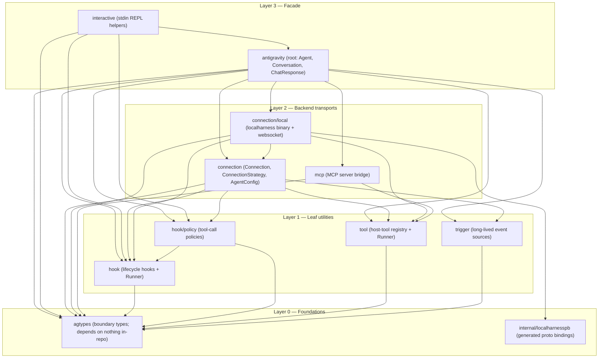
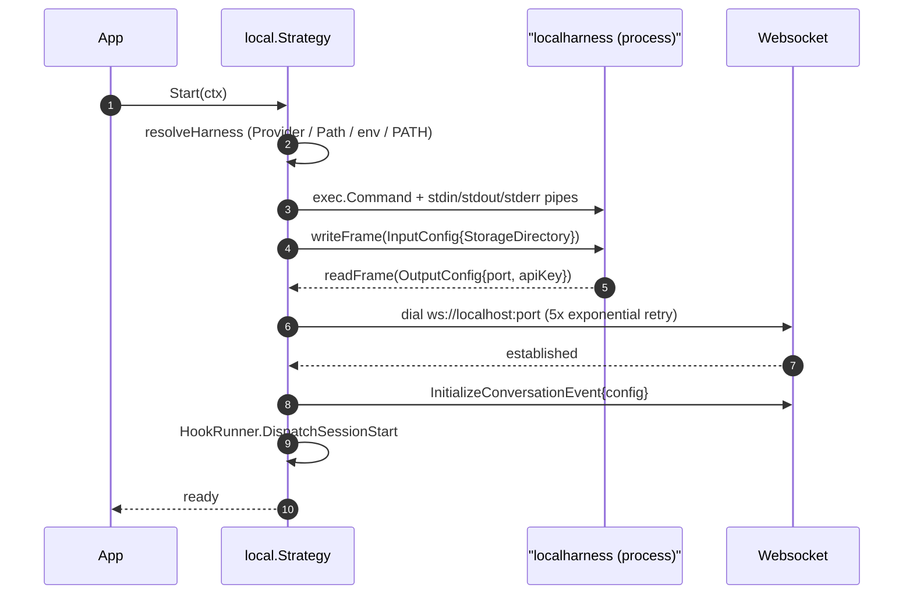
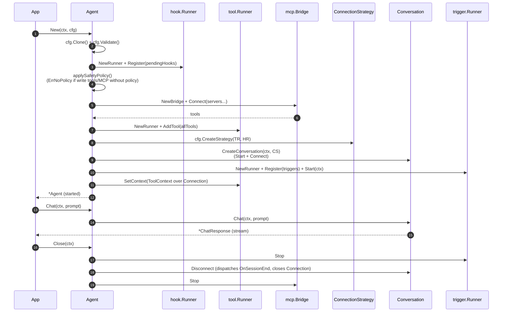
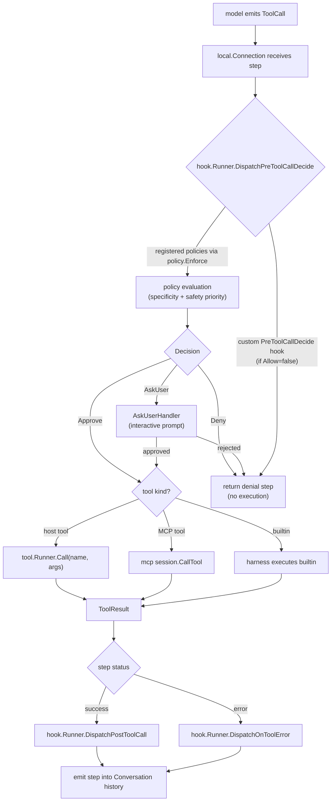

# アーキテクチャ

`antigravity-sdk-go` は、Google Antigravity および Gemini 上で AI エージェント
を構築するための Go SDK です。本 SDK は
[google-antigravity/antigravity-sdk-python](https://github.com/google-antigravity/antigravity-sdk-python)
の Go ポートであり、公開 API の表面とセマンティクスについては上流の Python
SDK が source of truth となります。プロジェクトはアルファ段階で、上流の `main`
ブランチを追跡しています。Go 1.26 を使用します。

本ドキュメントでは SDK 内部のレイヤ構成と、各レイヤが公開する契約について説明
します。扱うトピックは 10 個です。レイヤ構成、型の基盤、4 つのリーフユーティリ
ティ、Connection レイヤと唯一の組み込みバックエンド、MCP ブリッジ、Agent の
ライフサイクル、ツール呼び出しのディスパッチ、localharness バイナリとのワイヤ
プロトコル、並行性モデル、そして拡張ポイントです。上流 Python パッケージとの
公開シンボル単位の対応 — 意図的なギャップやリネームを含む — については、
[`PARITY.md`](../PARITY.md) を参照してください。

## 1. レイヤ構成

SDK は循環のない厳密な依存階層として構成されています。各レイヤは自分より下位の
レイヤにのみ依存し、同一レイヤ内の並びはトポロジカル順ではなくアルファベット
順です。



この階層は譲れません。これは、duck-typing 前提の Python 設計を静的型付けの Go
へ移植する際に直面する 3 つの具体的な問題を解決するためです。

- **型の隔離。** `agtypes` を依存ルートに据えているのは、ルートの `antigravity`
  パッケージ（`Agent`、`Conversation`、`ChatResponse` を定義する）と
  `connection` パッケージの両方が、同じ境界型を参照する必要があるからです。これ
  らの型をどちらか一方に置けば、もう一方はそのパッケージを import せざるを得ま
  せん。しかし `connection` 自体も `antigravity` から import されるため、結果と
  して循環が生じます。これらの型を `agtypes` へ押し出すことで、構造上この循環が
  発生しないようにしています。
- **accept-interfaces イディオム。** Connection の一部だけを必要とする Layer 1
  のリーフ（`tool.conn`、`trigger.notifier` など）は、`connection.Connection`
  全体を import せず、自前の狭いインターフェイスを宣言します。具体型の
  `*LocalConnection` はそれらを構造的に満たすため、`Connection` インターフェイ
  スが拡張されてもリーフを再コンパイルする必要はありません。
- **internal 限定の proto。** `internal/localharnesspb` には
  `connection/local` からしか到達できません。Go の可視性ルールにより、生成さ
  れた proto 型 — ワイヤプロトコルの実装詳細 — が公開 API に漏れ出さないこと
  が保証されます。

## 2. 型の基盤 (`agtypes`)

`agtypes` は、SDK の API 境界を越えるすべての型を定義します。本パッケージは
リポジトリ内の他の何にも依存せず、依存ツリーのルートとなります。

内容は 7 つのグループに分類されます。

| ファイル          | 型                                                                                              |
|------------------|--------------------------------------------------------------------------------------------------|
| `config.go`      | `GeminiConfig`、`ModelConfig`、`ModelEntry`、`GenerationConfig`、`CapabilitiesConfig`、`SystemInstructions` とその派生 |
| `content.go`     | `Content`、`ContentPrimitive`、`Media`、`Image`、`Document`、`Audio`、`Video`、`FromFile`                |
| `enums.go`       | `ThinkingLevel`、`BuiltinTools`、`StepType`、`StepSource`、`StepTarget`、`StepStatus`、`TriggerDelivery`、`FileChangeKind` |
| `errors.go`      | `ConnectionError`、`ValidationError`                                                            |
| `hooks.go`       | `HookResult`、`AskQuestionOption`、`AskQuestionEntry`、`AskQuestionInteractionSpec`、`QuestionResponse`、`QuestionHookResult` |
| `step.go`        | `Step`、`UsageMetadata`                                                                          |
| `tools.go`       | `ToolCall`、`ToolResult`                                                                         |
| `response.go`    | `StreamChunk`、`Thought`、`Text`、`FileChange`、`ChatChunk`                                      |

ポーティング上の重要な規約が 3 点あり、これは SDK の他の部分を理解する上で
必須です。

### 直和型は sealed interface

Python の `T | U` ユニオンは、非公開のマーカーメソッドを持つ Go の interface
になります。

- `StreamChunk` — `Thought` と `Text` が実装（モデル出力チャンク）。
- `SystemInstructions` — `CustomSystemInstructions`（システムプロンプトの完全
  置換）と `TemplatedSystemInstructions`（既定の指示に
  `SystemInstructionSection` を追記する形式）が実装。
- `McpServerConfig` — `McpStdioServer`、`McpSseServer`、
  `McpStreamableHTTPServer` が実装。
- `Media` — `Image`、`Document`、`Audio`、`Video` が実装。それぞれ `MIME()`、
  `Desc()`、`Bytes()` と `isMedia()` マーカーを持ちます。コンストラクタ
  `NewImage`、`NewDocument`、`NewAudio`、`NewVideo` は `(T, error)` を返し、
  `FromFile(path, desc)` は拡張子からディスパッチします。

マーカーメソッドは `agtypes` 内部に閉じているため、実装の集合はコンパイル時に
固定されます。直和型の制約を緩める型エイリアスも 2 つあります。`ContentPrimitive
= any`（ドキュメント上 `string` または `Media`）と `Content = any`（ドキュメン
ト上 `ContentPrimitive` または `[]ContentPrimitive`）です。`ChatChunk = any` も
同様で、`StreamChunk` と `ToolCall` を含むドキュメント上のユニオンを表します。

### バリデータは明示的

Pydantic の `model_validator(mode="after")` は、レシーバ上の `Validate() error`
メソッドか、または `(T, error)` を返すコンストラクタとして表現されます。Go の
ゼロ値が暗黙のうちに強制されることはありません。たとえば
`agtypes.NewModelEntry("gemini-3.1-pro-preview")` は、上流の「裸の文字列が
ModelEntry に強制される」挙動を明示的な API に置き換えたものです。既定のモデル
は `gemini-3.5-flash`、既定の画像生成モデルは `gemini-3.1-flash-image-preview`
で、いずれも `DefaultModel` および `DefaultImageGenerationModel` 定数として
公開されています。

### `CapabilitiesConfig.ActiveBuiltinTools` の解決ルール

`CapabilitiesConfig` には `EnabledTools` と `DisabledTools` のスライスがあり、
両者は相互排他です。正式な解決は `ActiveBuiltinTools()` 内にあります。

- `EnabledTools` が non-nil なら、その複製を返します（allowlist）。
- そうでなく `DisabledTools` が non-nil なら、`AllTools()` から拒否集合を引いた
  ものを返します。
- どちらも未指定なら、`AllTools()` を返します。

connection レイヤ（ハーネスへのツール広告時）と Agent の安全ポリシーガード
（書き込みツールが有効か判定する時）の両方がこのメソッドを呼ぶため、解決ロジ
ックは両所で完全に一致します。

### `Step` と `Extra`

`Step` は SDK の中で最も頻繁に扱われる型です。上流は Pydantic の
`extra="allow"` を使いますが、Go 版は `Extra map[string]any` フィールドに
`json:",inline"` を付けて同等の挙動を保持します。ローカル接続レイヤは独自の
プライベートフィールドをドキュメント化されたキー（`cascade_id`、`trajectory_id`、
`wire_target`、`http_code` — `connection/local/step.go` で定義）でここに詰め
ます。これにより消費側は `connection/local` に依存せず
`step.Extra["cascade_id"]` として読み出せます。命名フィールドへ昇格していない
LocalConnection 固有データも、ローカルバックエンドが `Step.Extra` を介して
拡張する形で扱います。

### `internal/localharnesspb`

ワイヤプロトコル用に生成された protobuf バインディングです。これは構造体リテラル
ではなく opaque builder API（`pb.X_builder{...}.Build()`）を使用します。これは
上流が用いる proto ジェネレータが強制するランタイム契約です。バインディングは
上流の `localharness_pb2.py` のブロブ `b51c2f3` から派生しています（上流リポジ
トリには `.proto` ソース自体は存在しません）。本パッケージは internal であり、
`connection/local` 以外からの import は不可です。

## 3. リーフユーティリティ

### `hook`

`hook` は、ライフサイクルフックの分類体系と、それらにイベントをディスパッチ
する `Runner` を定義します。具体的な各フックは、クラス階層ではなく型付き関数値
として表現します。Go の関数型は、上流のデコレータでラップされた callable の自
然な対応物であり、各フックは固定された 1 つのデータ型を持ちます。すべてのフッ
ク型は sealed な `Hook` インターフェイスを満たすため、`Runner.Register` は任意
のフックを受け取り、動的型に応じてルーティングできます。

#### フックの種類

9 つのフック種類が定義されており、3 つの系統に分類されます。

| 種別                 | 系統      | シグネチャ                                                                                  |
|----------------------|-----------|---------------------------------------------------------------------------------------------|
| `OnSessionStart`     | Inspect   | `func(ctx, *Context) error`                                                                |
| `OnSessionEnd`       | Inspect   | `func(ctx, *Context) error`                                                                |
| `PreTurn`            | Decide    | `func(ctx, *Context, prompt agtypes.Content) (agtypes.HookResult, error)`                  |
| `PostTurn`           | Inspect   | `func(ctx, *Context, response string) error`                                               |
| `PreToolCallDecide`  | Decide    | `func(ctx, *Context, call agtypes.ToolCall) (agtypes.HookResult, error)`                   |
| `PostToolCall`       | Inspect   | `func(ctx, *Context, result agtypes.ToolResult) error`                                     |
| `OnToolError`        | Transform | `func(ctx, *Context, toolErr error) (replacement any, handled bool, err error)`            |
| `OnInteraction`      | Transform | `func(ctx, *Context, spec agtypes.AskQuestionInteractionSpec) (result agtypes.QuestionHookResult, handled bool, err error)` |
| `OnCompaction`       | Inspect   | `func(ctx, *Context, data any) error`                                                      |

Inspect フックは読み取り専用かつ非ブロッキング（オブザーバビリティ目的）です。
Decide フックは読み取り専用ですがブロッキング（ポリシー）です。Transform フッ
クは検査対象のデータを書き換えることができます（モデルが目にするエラー、ユー
ザの質問への回答など）。

`OnToolError` と `OnInteraction` は `(value, handled, error)` の 3 値返却規約に
従います。`handled=false` を返せば、このフックはイベントを処理しなかったと宣
言したことになり、次のフック（または harness の既定フォーマット処理）が引き
継ぎます。

#### フックコンテキスト

`hook.Context` はすべてのフックに渡される状態保持オブジェクトです。コンテキスト
は 3 階層のチェーンを形成し、`NewSessionContext`、`NewTurnContext(session)`、
`NewOperationContext(turn)` で生成します（セッション → ターン → オペレーション）。
`Get` はルート方向に各階層を辿って探索し、`Set` はローカルコンテキストのストア
にのみ書き込みます。`Context` は並行使用に対して安全ではありません。1 つの
ディスパッチ内のフックはすべて順次実行されます。

セッションコンテキストは Runner が所有します（`runner.SessionContext()`）。
ローカル接続は `DispatchPreTurn` 内でターンコンテキストを生成し、
`DispatchPostTurn` が走るまで `currentTurnCtx` に保持します。ツール呼び出し
フックには、ターンコンテキストを親とするオペレーションコンテキストが渡されま
す。これにより、`PostToolCall` フックは同じオペレーション内で
`PreToolCallDecide` フックが書き込んだ状態を読み取れます。

#### 安全ガードのエスケープハッチ

`Runner.HasPreToolCallDecide` は、Agent の安全ポリシーガード（§6）に対する
エスケープハッチです。`PreToolCallDecide` フックを登録したユーザは、自身で
ツール呼び出しのゲーティングを行っていると見なされるため、`ErrNoPolicy` は
発生しません。

### `hook/policy`

`policy` は、フックレイヤを通じて強制される宣言的なツール呼び出しルールシステ
ムです。`Policy` はツール名（または `"*"` ワイルドカード）に対して APPROVE /
DENY / ASK_USER を表現し、必要に応じて呼び出しに対する `Predicate` でガード
できます。`Policy.Name` は人間可読のラベルで、ログや拒否メッセージに表示され
ます。

#### 優先度と短絡評価

複数のポリシーは 6 つの優先度バケットに分類されます。

```
specific deny > specific ask > specific allow >
wildcard deny > wildcard ask > wildcard allow
```

`policy.Enforce` はコンパイル時にポリシーをこれらのバケットに事前ソートしま
す。これにより返されるフックは、最も優先度の高い非空バケット内で最初にマッチ
したものを検出した時点で短絡できます。同一バケット内では、最初にマッチした
ものが採用されます。

#### Fail-closed な評価

コンパイルされたフックは 3 つの形で fail-closed に倒れます。

- **事前バリデーション。** `Enforce` は handler の付いていない `AskUser` ポリ
  シーを拒否し、`ErrMissingAskUserHandler` を joined error として返します。
  失敗は最初の呼び出し時ではなく、コンパイル時に発生します。
- **Predicate エラーは拒否。** `Predicate` がエラーを返した場合、ポリシー評価
  はエラーをログに残しつつ、当該ポリシーを名指しした拒否 `HookResult` を生成
  します。エラーが呼び出し側に伝播することはなく、モデルから見えるのは
  「拒否」だけです。
- **panic は拒否。** `Predicate`、`AskUser` ハンドラ、適用ステップで発生した
  panic は recover され、ログされたうえで拒否 `HookResult` に変換されます。
  フックが呼び出し側に panic を伝えることはありません。

どのポリシーにもマッチしない場合は、フックは呼び出しを許可します（デフォルト
オープン）。これは `WorkspaceOnly` と `ConfirmRunCommand` 自体がオプトインの
ポリシーであり、ローカル設定が前置することで初めて効力を持つためです。

#### あらかじめ用意されたルールセット

- `AllowAll()` — すべての呼び出しを承認。
- `DenyAll()` — すべての呼び出しを拒否。特定の `Allow` と組み合わせれば、
  deny-by-default 構成になります（specific が wildcard を上回るため）。
- `SafeDefaults(handler)` — 読み取り専用ツールは承認、それ以外はユーザに確認。
- `ConfirmRunCommand(handler)` — `run_command` を拒否（handler が non-nil なら
  確認）、他はすべて承認。`Policies` が未指定のときローカルバックエンドが
  既定で設定する内容です。
- `WorkspaceOnly(workspaces)` — `ToolCall.CanonicalPath` が列挙されたディレク
  トリの外にあるファイルツール呼び出しを拒否。`Workspaces` が非空のとき、
  ローカルバックエンドが常に先頭に追加します。

#### パス包含 (`policy/path.go`)

`IsPathInWorkspace` は `WorkspaceOnly` とユーザ定義 Predicate の両方で共有さ
れます。両パスは比較前に正規化されます（絶対化と symlink 解決）。その後
`filepath.Rel` を使って比較します。3 つの性質が重要です。

- **生入力に対する `..` 拒否。** `..` セグメントを含むターゲットは即座に拒否
  します。これは `filepath.Abs` / `filepath.Clean` が `symlink/..` ペアを字句
  的にキャンセルしてしまい、symlink 解決から traversal が隠蔽されるのを防ぐ
  ためです。`filepath.ToSlash(path)` と `path` の両方をスキャンするので、
  Windows の `\` セパレータも検出できます。
- **ワークスペースの厳密な存在確認。** ワークスペースはディスク上に存在する
  必要があります。解決失敗は `false`（包含されない）を返します。ターゲットに
  ついては最長の既存祖先を `EvalSymlinks` で解決し、まだ生成されていない末尾
  をクリーン化して結合し直します。これは上流の `resolve(strict=False)` 挙動
  と対応します。
- **大文字小文字非依存ファイルシステムのヒューリスティック。** macOS と
  Windows では `Rel` 評価前に小文字化してから比較します。判定は `runtime.GOOS`
  をキーとするため、パスごとの stat 探査は行いません。これらのプラットフォーム
  上で稀に存在する case-sensitive ボリュームでは過剰制限側に倒れますが、
  セキュリティポリシーとしては安全側です。

TOCTOU レース（ここで検証されたパスが、ツールが作用する前に symlink で置換
される可能性）は残ります。この制約は上流 SDK と共通であり、ここでは防御し
ません。

### `tool`

`tool` はインプロセスのツールレジストリです。中心となる型は `Tool` 関数値
です。

```go
type Tool func(ctx context.Context, args map[string]any) (any, error)
```

`ToolWithSchema` はこれに `Name`、`Description`、`InputSchema`（JSON Schema）
を組み合わせます。`Runner` はツールを名前で索引化し、connection レイヤはツール
をモデルに広告する際にスキーマを使用します。

#### `ToolContext` 注入

会話側の機能を持つ `ToolContext` は `context.Context` 経由で注入されるため、
ツール側は `tool.FromContext` で取得できます。

```go
func myTool(ctx context.Context, args map[string]any) (any, error) {
    tc, ok := tool.FromContext(ctx)
    if !ok { /* 機能なし */ }
    return nil, tc.Send(ctx, "follow-up message")
}
```

`Runner` は呼び出しごとに `WithToolContext(ctx, r.tc)` を呼ぶため、すべての
ツールが同じ `ToolContext` を見ることになります。`ToolContext` は狭い `conn`
インターフェイス（`ConversationID`、`IsIdle`、`SendTriggerNotification` だけ）
をラップし、加えて会話ごとのキー/値ストア（`sync.RWMutex` でガード）をツール
間で共有します。

#### 並行ディスパッチ

`Runner.ProcessToolCalls` は入力呼び出しを `sync.WaitGroup.Go` で goroutine に
ファンアウトし、各結果を入力位置に対応付けて収集してからバッチ完了を待ちます。
未登録ツールやツールエラーは、`Error` が populated され `Exception` が Go 側
のエラー値を保持した `ToolResult` になります — バッチ全体が失敗することは
ありません。

#### 型付きツール

`tool.Typed(fn, name, description)` は、静的型付けのツール本体を書くためのヘル
パです。

```go
type AddArgs struct {
    A, B int `json:"a"`
}
ts := tool.Typed(func(ctx context.Context, a AddArgs) (int, error) {
    return a.A + a.B, nil
}, "add", "Sum two integers.")
```

`Typed` は引数型をリフレクションで解析し、JSON Schema を生成し、`Fn` で
`map[string]any` を `T` にデコードして型付き関数を呼び出して結果を返す
`ToolWithSchema` を生成します。スキーマを完全に制御したい場合は、
`ToolWithSchema` をリテラルで構築する方法を取ってください。

### `trigger`

`trigger` は、エージェントセッションと並行して動作し、会話側にメッセージを
プッシュする長寿命のイベントソースを提供します。`Trigger` は次の関数型です。

```go
type Trigger func(ctx context.Context, tc *Context) error
```

`ctx` がキャンセルされるまで動作し続け、`tc.Send` でメッセージを配送します。
`Runner` は、セッション開始時に登録された各トリガーを 1 つの goroutine とし
て起動し（トリガーあたり 1 goroutine）、セッション終了時にすべてキャンセル
します。

`Context`（`hook.Context` とは別の型）は、`SendTriggerNotification` のみを
含む狭い `notifier` インターフェイスを保持します。`connection.Connection`
全体はこれを構造的に満たすため、`trigger` パッケージは `agtypes` と標準ライ
ブラリのみに依存し、`connection` に依存しません。パッケージ内の conformance
テストがこの性質を保証します。

代表的なケースには 2 つのヘルパが用意されています。

- `Every(interval, callback)` — `callback` を一定間隔で発火させます。最初の
  呼び出しは `interval` だけ遅延します（即時呼び出しではありません）。これは
  上流の挙動と一致します。`interval <= 0` のときは panic します。
- `OnFileChange(path, callback)` — `path` を監視し（ディレクトリなら再帰的）、
  各イベントごとに 1 つ以上の `agtypes.FileChange` を引数として `callback`
  を呼び出します。ファイル監視には
  [`fswatcher`](https://github.com/fswatcher/fswatcher) を使用するため、この
  依存は常時利用可能です（上流は `watchfiles` を遅延 import します）。生の
  `fswatcher.Op` フラグは変換されます。`Create` → `FileChangeAdded`、
  `Remove`/`Rename` → `FileChangeDeleted`、その他（`Write`/`Chmod`）→
  `FileChangeModified` です。

## 4. Connection レイヤ

`connection` パッケージはトランスポート非依存のインターフェイスを定義し、具体
的なバックエンドはサブパッケージに置かれます。組み込みのバックエンドは
`connection/local` のみで、上流の `localharness` バイナリと websocket で
通信します。

### インターフェイス

`Connection` は、稼働中のエージェントセッションに対する SDK 側のハンドルで
す。インターフェイスは 11 のメソッドを持ちます。

- **状態**: `IsIdle`、`ConversationID`。
- **送信**: `Send`、`SendToolResults`、`SendTriggerNotification`。
- **受信**: `ReceiveSteps`（`iter.Seq2[agtypes.Step, error]` を返却）。
- **ライフサイクル**: `Disconnect`、`Cancel`、`Delete`。
- **アイドル制御**: `SignalIdle`、`WaitForIdle`、`WaitForWakeup`。

`BaseConnection` は埋め込み可能な struct で、オプショナルなメソッドすべてに
no-op の既定実装を提供します（`IsIdle`、`ConversationID`、`Disconnect`、
`Cancel`、`Delete`、`SignalIdle`、`WaitForIdle`、`WaitForWakeup`、
`SendToolResults`）。`Send`、`ReceiveSteps`、`SendTriggerNotification` は
意図的に実装していません — これらには合理的な既定が存在しないため、埋め込み
側が必ず提供する必要があります（具体型を `Connection` として使った時点で
コンパイラが強制します）。

`ConnectionStrategy` はバックエンドの起動（`Start`）、`Connection` の払い出
し（`Connect`）、後片付け（`Close`）の方法を知るインターフェイスです。
`Connect` が `Start` 前に呼ばれると `ErrNotStarted` が返されます。これは
上流の `async with` ライフサイクルに対応する Go 表現です。

`AgentConfig` はユーザ設定を保持し、`CreateStrategy(toolRunner, hookRunner)`
を通じてストラテジを生成します。インターフェイスには 3 グループのメソッドが
あります。共有設定の getter 12 個、Agent が使う setter（`SetCapabilities`、
`SetPolicies`）、ライフサイクル（`CreateStrategy`、`Clone`、`Validate`）です。

### `BaseAgentConfig` の契約

`BaseAgentConfig` struct は、すべてのバックエンドで共通のフィールドを保持し
ます。

| フィールド          | 型                            | 用途                                                       |
|---------------------|-------------------------------|------------------------------------------------------------|
| `SystemInstructionsValue` | `agtypes.SystemInstructions` | 既定のシステムプロンプトを上書き／追記                     |
| `CapabilitiesValue` | `agtypes.CapabilitiesConfig`  | ツール公開とサブエージェント設定                           |
| `ToolsValue`        | `[]tool.ToolWithSchema`       | ホスト側カスタムツール                                      |
| `PoliciesValue`     | `[]policy.Policy`             | ツール呼び出しポリシー                                      |
| `HooksValue`        | `[]hook.Hook`                 | ライフサイクルフック                                        |
| `TriggersValue`     | `[]trigger.Trigger`           | 長寿命イベントソース                                        |
| `MCPServersValue`   | `[]agtypes.McpServerConfig`   | ブリッジする MCP サーバ                                     |
| `WorkspacesValue`   | `[]string`                    | ワークスペースディレクトリ                                  |
| `ConversationIDValue`| `string`                     | 既存会話を再開する場合に指定                                |
| `SaveDirValue`      | `string`                      | 会話状態の永続化先                                          |
| `AppDataDirValue`   | `string`                      | アプリケーションデータディレクトリ                          |
| `ResponseSchemaValue`| `string`                     | 構造化出力用 JSON-Schema                                    |
| `SkillsPathsValue`  | `[]string`                    | スキル定義のパス                                            |

具体的な設定はこれを埋め込み、バックエンド固有のフィールドを追加します。
`AgentConfig` の契約のうち、特に重要な点が 2 つあります。

- **`Clone()` は deep copy だが、ドキュメント化された例外がある。** Agent は
  起動時に設定を deep copy するため、呼び出し側がその後に設定を書き換えても
  稼働中セッションには影響しません。値フィールドは deep copy されますが、
  `hooks`、`triggers`、`tools` の各スライスは浅いコピーとなり、ユーザ提供
  コールバックの識別性が保持されます。これは上流の `model_copy(deep=True)`
  と元リストスナップショットを組み合わせた挙動に一致します。
- **`Validate()` は冪等。** バックエンドは既定値とバリデータを `Validate()`
  内で適用します。Agent はコンストラクション時にこれを呼ぶため、バックエンド
  の `Build()` を事前に呼ばずに `New` に直接設定を渡しても完全に構成された
  状態になります。具体的な設定は副作用のあるステップが再実行されないよう
  ガードを設けます（ローカルバックエンドはプライベートな `validated` フラグ
  を使ってワークスペースポリシーの再前置を防ぎます）。

### ローカルバックエンド (`connection/local`)

ローカルバックエンドの責務は 6 つです。プロセス管理（`strategy.go`）、バイナ
リ解決（`binary.go`）、ハンドシェイク（`framing.go`、`strategy.go`）、稼働中
の websocket 接続（`connection.go`、`reader.go`）、ステップ解析（`step.go`、
`types.go`）、設定レイヤ（`config.go`）です。

#### バイナリ解決

`Strategy.Start` は `localharness` バイナリを次の順序で解決します。

1. `HarnessProvider`（設定済みなら）— パスとクリーンアップを返すコールバック
   です。`//go:embed` したバイナリ向けで、§10 参照。
2. `AgentConfig.HarnessPath`（非空なら）。
3. `ANTIGRAVITY_HARNESS_PATH` 環境変数。
4. `exec.LookPath("localharness")`。

バイナリが見つからないと `ErrBinaryNotFound` が返されます。エラーメッセージ
には 4 つの解決ソースすべてが列挙されるため、ユーザはどれを設定すべきかが
すぐ分かります。

#### ハンドシェイク

ハンドシェイクは harness の stdin/stdout パイプ上で、長さ前置形式のフレーミン
グ（`framing.go`）を使って 2 つの protobuf メッセージを交換します。



websocket dial は 5 回の指数バックオフを使用します（ベース遅延 100 ms、
すなわち `100 ms`、`200 ms`、`400 ms`、`800 ms`、その後 `1.6 s`）。これは
harness が `OutputConfig` を出力した直後にはまだ listen していない可能性が
あるためです。dial には harness が払い出した API キーを `x-goog-api-key`
ヘッダで添付します。

stderr は 100 行のリングバッファ（`stderrBuffer`）に取り込まれ、背後の
goroutine がドレインします。ハンドシェイクが失敗した場合、harness を kill
した上でバッファ末尾を返却エラーに付加するため、harness の診断出力がパイプ
クローズによって失われずユーザに届きます。

#### リーダーループとイベントディスパッチ

単一の `readerLoop` goroutine が websocket を消費し、`OutputEvent` の
`which` 判別子でディスパッチします。扱うイベントは 3 種類です。

| イベント                   | ハンドラ                          | 振る舞い |
|----------------------------|----------------------------------|----------|
| `StepUpdate`               | `handleStepUpdate`               | step tracker を更新、`agtypes.Step` に解析、`stepCh` にプッシュ、該当なら `OnCompaction` を発火、過去に承認済みのビルトイン呼び出しの `PostToolCall`/`OnToolError` を遅延発火、wait-state リクエストをディスパッチ。 |
| `TrajectoryStateUpdate`    | `handleTrajectoryStateUpdate`    | 親／サブエージェントの running/idle 遷移を追跡。サブエージェント（`start_subagent`）完了時に `PostToolCall` を発火。親が idle かつアクティブなサブエージェントが 0 のとき connection idle を立てる。 |
| `ToolCall`                 | `handleToolCall`（バックグラウンド）| ホスト側ツールを実行する。tool-call ステップをエンキューし、`PreToolCallDecide` を実行（拒否 → エラー結果）、`tool.Runner.ProcessToolCalls` で実行、`PostToolCall` または `OnToolError` を発火、`SendToolResults` で結果を返送。 |

リーダーの終端挙動はコンテキスト依存です。期待されたクローズ（`Disconnect`
中）は無音で終了します。harness 側からの websocket クローズはクローズコード
と取得済みの stderr 末尾を含む `ConnectionError` になります。それ以外の read
エラーは原因をラップした `ConnectionError` になります。

#### ステップ解析 (`step.go`)

`stepFromUpdate` は `StepUpdate` proto を `agtypes.Step` に変換し、いくつかの
正規化を行います。

- **Step ID の合成。** Step id は `trajectoryID:stepIndex`（trajectory id が
  空なら `stepIndex` のみ）で、上流と一致します。
- **ビルトインアクション検出。** `StepUpdate` は最大 1 つのビルトインアクシ
  ョンを保持します（proto の oneof）。`activeAction` は 10 のアクション
  （`create_file`、`edit_file`、`find_file`、`list_directory`、`run_command`、
  `search_directory`、`view_file`、`invoke_subagent`、`generate_image`、
  `finish`）を列挙し、名前とアクションメッセージを返します。
- **引数抽出。** アクションメッセージは
  `protojson.MarshalOptions{UseProtoNames: true}` → `gojson.Unmarshal` 経由で
  `map[string]any` に変換されます。中間 JSON は proto フィールド名
  （snake_case）を保持するため、ポリシー Predicate は上流と同じキー名を見る
  ことになります。
- **正規化パス。** 一部の引数キー（`path`、`file_path`、`TargetFile`、
  `directory_path`）はファイルシステムパスとして扱われ、正規化されます。
  `file://` URL はパーセントデコードされた `Path` コンポーネントに、それ以外
  はそのまま通過します。選ばれたパスは `ToolCall.CanonicalPath` に格納さ
  れ、ワークスペースポリシーが評価対象とします。
- **Extra キーの昇格。** `cascade_id`、`trajectory_id`、`wire_target`、
  `http_code` は、`connection/local` がエクスポートする命名定数のキー名で
  `Step.Extra` に格納されます。

#### Wait-state デバウンス (`stepTracker`)

harness は SDK が応答するまで `WAITING_FOR_USER` ステップを再送する可能性が
あります。各ステップには `stepTracker` があり、状態遷移と、SDK が処理を
開始済みの wait-state リクエスト種別（`questions_request`、
`tool_confirmation_request`）の集合を記録します。`markHandled` はその種別が
初めて出現したときだけ `true` を返すため、重複ブロードキャストが重複フック
ディスパッチを引き起こすことはありません。

#### ビルトインツール出力型

ビルトインツール実行の構造化結果は `StepUpdate` のアクションごとフィールドか
ら取り出され、sealed な `ToolOutput` インターフェイスを実装する具体的な Go
型として公開されます。

| ビルトイン        | 結果型                      | 補足 |
|-------------------|----------------------------|------|
| `run_command`     | `RunCommandResult`         | `Output` フィールド |
| `list_directory`  | `ListDirectoryResult`      | 各エントリは `ListDirectoryEntry{Name, IsDirectory, FileSize}`。`String()` は 1 エントリ 1 行で描画 |
| `search_directory`| `SearchDirectoryResult`    | マッチ件数 |
| `find_file`       | `FindFileResult`           | 出力テキスト |
| `edit_file`       | `EditFileResult`           | diff サマリ |
| `generate_image`  | `GenerateImageResult`      | 生成された画像名 |
| その他            | `TextResult`               | 汎用フォールバック（`view_file` など） |

これらの値は `PostToolCall` フックの `ToolResult.Result` に流れ込み、ワイヤで
`ToolResponse` として送られる際は JSON エンコードされます。

#### `local.AgentConfig` と `Validate`

ローカル設定は、`GeminiConfig`、`Model` および `APIKey` ショートハンド、
`HarnessPath`、`HarnessProvider` を追加します。`Validate`（`Build` 経由、
または Agent が自動的に呼ぶ）は次を適用します。

1. **ショートハンドの統合。** `Model` → `GeminiConfig.Models.Default.Name`
   （両方指定はエラー）、`APIKey` → `GeminiConfig.APIKey`（両方指定はエラー）。
2. **既定モデル。** `GeminiConfig.Models.Default.Name` が空なら
   `agtypes.DefaultModel` を設定。`Capabilities.ImageModel` が空なら
   `DefaultCapabilitiesConfig` を全体に適用。
3. **既定ワークスペース。** `Workspaces` が nil ならカレントディレクトリを
   使用。
4. **AppDataDir 検証。** 設定された場合は絶対パスでなければならず、違反時は
   `ValidationError` を返します。
5. **既定ポリシー。** `Policies` が nil なら `ConfirmRunCommand(nil)` を設定
   （`run_command` を拒否、他は許可）。
6. **ワークスペースポリシーの前置。** `Workspaces` が非空のとき、アプリデー
   タディレクトリ（既定 `~/.gemini/antigravity`）を allowlist に追加し、
   `policy.WorkspaceOnly(allowlist)` を `Policies` の**先頭**に挿入します。
   これにより、ユーザがどんなポリシーを追加してもファイルツールは常にサンド
   ボックス内に閉じ込められます。

プライベートな `validated` フラグにより、2 度目以降の呼び出しでワークスペー
スポリシーが再前置されることはありません。

## 5. MCP ブリッジ (`mcp`)

`mcp.Bridge` は、stdio / SSE / streamable HTTP のいずれかで 1 つ以上の
Model Context Protocol サーバに接続し、各サーバが広告するツールを発見して、
それらを `tool.ToolWithSchema` にアダプトします。アダプトされたツールの
`Fn` は、呼び出しを発生元のセッションに転送します。`Agent` は起動時にこれら
のツールをホスト側ツールと並べて登録します。

本ブリッジは自作クライアントではなく、公式の
[modelcontextprotocol/go-sdk](https://github.com/modelcontextprotocol/go-sdk)
の上に構築されています。フローは次のとおりです。

1. **トランスポートのディスパッチ。** `Connect` は
   `agtypes.McpServerConfig` 直和型のバリアントに応じてディスパッチします。
   - `McpStdioServer` → `CommandTransport{Command: exec.Command(c.Command, c.Args...)}`
   - `McpSseServer` → `SSEClientTransport{Endpoint: c.URL}`
   - `McpStreamableHTTPServer` → `StreamableClientTransport{Endpoint: c.URL}`
   - その他の型 → 動的型を名指ししたエラー。
2. **セッション確立。** 単一の `mcpsdk.Client` をすべての接続で再利用しま
   す。各 `Connect(ctx, transport, nil)` が返すセッションは `b.sessions` に
   追加されます。
3. **ツール発見。** 接続後、`ListTools(ctx, nil)` がサーバの広告するツールを
   列挙します。各ツールの `InputSchema`（MCP SDK 上は `any` 型 — JSON
   Schema 値を入れる枠だから）は `schemaToMap` で `map[string]any` に正規化
   されます。最初は直接の cast を試み、失敗すれば JSON marshal+unmarshal
   にフォールバックすることで、どんなソースから来た型でも合流させます。
4. **アダプタ生成。** 発見された各ツールは `tool.ToolWithSchema` になります。
   その `Fn` は `session.CallTool(ctx, {Name, Arguments})` を呼びます。結果
   は `res.StructuredContent` を優先し、nil の場合のみ `contentText` が
   `TextContent` 項目を結合した文字列を返します。

`Stop` はすべてのアクティブセッションをクローズし、最初の close エラーを返
却用に保持します。Agent は `teardown` 内でこれを呼び出します。

## 6. Agent のライフサイクル

`Agent` は Layer 3 のエントリポイントです。設定済みセッション、すなわち
connection、conversation、hook/tool/trigger ランナー、および任意の MCP
ブリッジを所有します。`New(ctx, config)` で構築し、`Chat`（または
`Conversation()` アクセサ）で駆動し、`Close` でリリースします。



### `NewAgent` と `New`

`NewAgent(config)` は未起動の Agent を返します。次の 3 つを行います。

1. `config.Clone()` でオーナーシップを取得。
2. クローンに `ResponseSchema` が設定されていれば、それを
   `Capabilities.FinishToolSchemaJSON` にコピーし、`SetCapabilities` で書き
   戻します。
3. クローンの `Hooks()` と `Triggers()` をプライベートな `pendingHooks` /
   `pendingTriggers` スライスにスナップショットします。

`New(ctx, config) = NewAgent(config).Start(ctx)` です。呼び出し側はどちらを
使うか選べます。`New` はワンステップ版、`NewAgent`+`Start` は `Start` 前に
追加で `RegisterHook` を呼べる版です。

### `Start` の順序

`Start` は厳密に順序づけられた手順を踏みます。**再試行できません** — 保留中
のフックとトリガーは最初の呼び出しで消費されます。

1. `config.Validate()`（自身の `*ValidationError` を直接返す）。
2. `hookRunner = hook.NewRunner()`、保留フックを登録。
3. `applySafetyPolicy()`:
   - 読み取り専用ビルトインの集合を構築。
   - `Capabilities.ActiveBuiltinTools()` から `hasWriteTools` を計算。
   - `MCPServers()` から `hasMCP` を計算。
   - 書き込みツールまたは MCP サーバが有効で、`Policies()` が空で、
     `PreToolCallDecide` フックも登録されていなければ `ErrNoPolicy` を返却。
   - そうでなくポリシーが設定されていれば、`policy.Enforce` でコンパイル
     して得たフックを登録。
4. **以降の失敗は deferred 関数経由で `teardown(ctx)` を呼びます。** 部分
   構築された状態が外部に漏れることはありません。
5. MCP サーバを接続（あれば）。発見したツールをツールリストに追加。
6. `toolRunner = tool.NewRunner()`、すべてのツール（ホスト + MCP）を追加。
7. `strategy = config.CreateStrategy(toolRunner, hookRunner)`。
8. `CreateConversation(ctx, strategy)` — `strategy.Start` + `Connect`。
9. 保留トリガーがあれば、`triggerRunner = trigger.NewRunner(conv.Connection())`、
   登録、`Start`。
10. `toolRunner.SetContext(tool.NewToolContext(conv.Connection()))` でホスト
    ツールが `ToolContext` を見られるように配線。
11. `started.Store(true)`。

`RegisterHook` はいつでも呼べます。`Start` 前はミューテックスのもと
`pendingHooks` に追加され、`Start` 後は `hookRunner.Register` に転送され
ます。`RegisterTrigger` は `Start` 後に呼ばれると `ErrAgentStarted` を返
します — トリガーランナーが起動済みになるとトリガーは追加できません。

### `Close` の順序

`Close` は `teardown(ctx)` を呼び、起動と逆順で巻き戻します。

1. トリガーランナーがあれば停止（すべてのトリガー goroutine をキャンセル）。
2. `conversation.Disconnect(ctx)` — harness のシャットダウン手順は §9 参照。
   その内部で `OnSessionEnd` のディスパッチと websocket クローズが行われ
   ます。
3. MCP ブリッジがあれば `mcpBridge.Stop()`。
4. `started.Store(false)`。

各ステップのエラーは蓄積され、`errors.Join` で結合されます。`Close` は部分
起動状態の Agent に対しても安全です（各ステップが nil チェックを行う）。

### `Conversation`

`Conversation` は単一のエージェントセッションをラップします。ステップ履歴
を蓄積し、ターンごとの開始インデックスと compaction インデックスを記録し、
トークン使用量を集計し、step レベルと chunk レベルの両方のイテレータを公開
します。既定の履歴上限は 10,000 ステップ（`DefaultMaxHistorySize`）です。
これを超えると古いステップが破棄され、ターンごとインデックスは有効性を保つ
ためにシフトされます。上限 0 は刈り込みを無効にします。

> **シングルアクティブイテレータ不変条件。** ストリームのイテレーション
> （`ReceiveSteps`、`ReceiveChunks`、`Chat` の裏側のストリーム）は同時に
> 1 つしかアクティブにできません。この不変条件によって、各ステップが履歴
> へちょうど一度だけ蓄積されることが保証されます。実装は `c.mu` でガード
> されたプライベートな `iterating` フラグを使用します。
>
> - `tryBeginIterate()` がフラグをアトミックに読み書きし、取得できれば
>   `true` を返します。
> - `endIterate()` が `defer` で解放します。
>
> アクティブなイテレーションがある状態で 2 つ目を開始しようとすると、即座
> に `ErrIterating` が yield されます。`Send` は特別で、接続が非アイドルの
> ときは、自分でイテレータを取得して前のターンをドレインする
> （`drainLockedIterator` を呼ぶ）か、別の goroutine がイテレータを保持し
> ていれば `WaitForIdle` で接続のアイドル化を待ちます。

履歴がちょうど一度だけ蓄積される鍵は `recordStep` にあります。
`ReceiveSteps` が yield する各ステップは、呼び出し側に yield される前に
必ずこれを通ります。`c.steps` への追記、compaction ステップ位置の
`c.compactionIdx` への記録、`UsageMetadata` 差分の `cumulativeUsage` と
`turnUsage` への集計、履歴上限の適用がここで行われます。

`ReceiveChunks` は `ReceiveSteps` の上に構築されます。`source=MODEL` か
つ `target=USER` のステップだけを通し、`ThinkingDelta` /
`ContentDelta` から `Thought` / `Text` を、各ステップの `ToolCalls` を
emit します。ツール呼び出しは 1 つのイテレーション内のステップ間で `ID`
により重複排除されます（重複排除集合はターン間でリセットされる）。
ID のない呼び出しは常に yield されます。

### `ChatResponse` — マルチカーソルストリーミング

`Chat` はターンの chunk ストリームを遅延バッファリングでラップした
`*ChatResponse` を返します。ラップには `iter.Pull2` を使い、push 型の
`iter.Seq2`（`ReceiveChunks` が返す）に pull 型の API を提供します。
`Chunks`、`Thoughts`、`TextDeltas`、`ToolCalls` の各イテレータメソッド
は、それぞれターンの先頭に位置する独立したカーソルを返します。

カーソルは順次でも、複数の goroutine から並行にでも消費できます。仕組み
は次のとおりです。

- 単一の `buf []agtypes.ChatChunk` スライスと `mu sync.Mutex` が共有状
  態をガードします。
- `at(pos)` がカーソルのプリミティブです。`pos < len(buf)` ならロックの
  もとバッファ値を返却 — fast path、上流 pull なし。そうでなければ
  ロックのもと上流から 1 件 pull して append します。並行カーソルは
  上流ストリームに対しては直列化されますが、バッファに対しては競合し
  ません。
- 終端状態（`done`/`err`）は粘性です。上流が終端を発した時点で、それ
  以降にライブエッジへ到達したカーソルはすべて同じ終端（または終端エラー）
  を見ます。終端エラーは、失敗後にライブエッジへ到達したすべてのカーソル
  に報告されます。

`Resolve`、`Text`、`StructuredOutput` はストリームをドレインしたうえで暗黙
に `Close` します。カーソルを取得したもののドレインしない呼び出し側は、
`iter.Pull2` リソースを解放するため明示的に `Close` してください。

## 7. ツール呼び出しのディスパッチ

エージェントがツールを呼び出すと決定すると、その要求は実行の前後でポリシー
レイヤとフックレイヤを通過します。harness は各ツール種別を異なる方法で
シグナルするため、ディスパッチパスは 3 種類に分かれます。

| ツール種別 | ワイヤイベント            | Decide-hook 発火点                      | 結果配送 |
|------------|---------------------------|----------------------------------------|----------|
| ビルトイン | `StepUpdate` の `ToolConfirmation` 待機 | `decideToolConfirmation`（同期） | ビルトインは harness 内で実行。同じステップが DONE/ERROR に達した時点で post フック発火（`pendingBuiltin` で追跡） |
| ホストツール | `ToolCall`             | `handleToolCall`（非同期）             | `tool.Runner.ProcessToolCalls` で実行、`SendToolResults` で結果送信 |
| MCP ツール | `ToolCall`               | ホストツールと同じ                     | `mcpsdk.ClientSession.CallTool` で実行、`SendToolResults` で結果送信 |
| サブエージェント | `TrajectoryStateUpdate` IDLE | （なし — spawn 時に事前決定）   | アイドル遷移時に `PostToolCall(start_subagent)` を、捕捉したサブエージェント応答とともに発火 |



このパイプラインで強調しておきたい性質が 5 点あります。

- **ポリシーによる拒否は「見えるが拒否される」状態。** ポリシーで拒否された
  ツールは引き続きモデルに広告されたままです（モデルが拒否から学習できるよ
  うに）。拒否されるのは個別の呼び出しのみです。これに対して
  `CapabilitiesConfig.DisabledTools` を使うと、ツール自体がモデルのコンテキ
  ストから完全に取り除かれます。
- **ワークスペーススコープはパスベースでありツールベースではない。**
  `WorkspaceOnly` は、`CanonicalPath` が設定済みワークスペースの外を指すフ
  ァイルツール呼び出しを拒否します。`CanonicalPath` が空のとき（connection
  レイヤが設定しなかった場合）も拒否されます — ポリシーは fail-closed です。
- **`OnToolError` はエラーを書き換え可能。** 登録された `OnToolError` フッ
  クは、モデルが目にする値として生のエラーの代わりに置換値を返せます。
  `(replacement, true, nil)` を返すと値が置換され `PostToolCall` がその値
  で発火、`(nil, false, nil)` だと harness の既定フォーマットに任せます。
- **ホストツールの拒否は harness に通知される。** `PreToolCallDecide` が
  ホストツール呼び出しを拒否すると、`handleToolCall` は
  `ToolResult{Error: "Tool execution denied by hook policy: "+message}` を
  返送します。モデルは hang ではなく構造化された失敗を受け取れます。
- **ホストツールの事前リクエスト短絡。** harness の `ToolConfirmation`
  リクエストのうち、既知のビルトインに当てはまらないアクションは、ホスト
  ツールの事前リクエスト（本来の呼び出しは後続の `ToolCall` イベントで届
  く）として扱われます。これらは harness を進めるため、名前
  `pre_request_host_tool_request` で自動承認されます。

### サブエージェント完了パス

`start_subagent` 呼び出しは spawn 時に決定されますが（標準の
`ToolConfirmation` パスで）、その完了は別経路で配送されます。

1. サブエージェント実行中、`source=MODEL` のモデルステップは
   `subagentResponses[trajID]` に記録されます。これにより最終的な
   `ToolResult.Result` がサブエージェントの最終応答を運びます。
2. harness はサブエージェントの trajectory id に対して
   `TrajectoryStateUpdate{state=IDLE}` を発します。
   `handleTrajectoryStateUpdate` はその trajectory を `activeSubagents` から
   除去し、捕捉した応答を読み出します。
3. `PostToolCall` が `Name=start_subagent` と捕捉応答（捕捉が空なら
   trajectory id）で発火します。
4. 接続がアイドルを示すのは、親がアイドルかつすべてのサブエージェントが
   完了した時のみです — `idleNow = parentIdle && len(activeSubagents) == 0`。

### Post-turn 検出

`PostTurn` は harness が発火するものではありません — SDK がステップストリー
ムからターン完了イベントを導出します。`maybeDispatchPostTurn` は次の 3 条件
を満たすステップに対してフックを発火します。

- 終端ステータス（`DONE`、`ERROR`、`CANCELED`）。
- ワイヤ上の `target=USER`（`Step.Extra[ExtraWireTarget]` から読み取り）。
- `source=MODEL`。

その他の終端ステップ（ツール結果など）はターンの返答ではなく、`PostTurn` を
発火しません。

## 8. ワイヤプロトコル

本セクションでは、接続のデバッグや代替 harness の実装に十分な深さで、
localharness バイナリとのプロトコルを記述します。ワイヤ形状は
`internal/localharnesspb` にあります。

> **プロトコルの二重性。** stdin ハンドシェイクは長さ前置形式の protobuf
> フレームを使います（4 バイトのリトルエンディアン長 + `proto.Marshal`
> ボディ。上流の `struct.pack("<I")` フレーミングと一致）。ハンドシェイク
> 完了後、SDK と harness は websocket 上で protojson エンコードされたイベ
> ントを交換します。両エンコーディングは意図的に重複しません — ハンド
> シェイクは websocket のポートと API キーを学習することだけが目的の私的
> なブートストラッププロトコルです。

### ハンドシェイク

ハンドシェイクで転送されるメッセージはちょうど 2 つです。

- **`InputConfig`**（SDK → harness、stdin）— `StorageDirectory` を運ぶ。これ
  は harness が会話状態を永続化するパスです。`SaveDir` 未指定時は SDK が
  毎回新規の `os.MkdirTemp("", "antigravity_")` ディレクトリを既定値とし
  ます。
- **`OutputConfig`**（harness → SDK、stdout）— `port`（ローカルポート番号）
  と `api_key`（プロセスごとのシークレット。harness はすべての websocket
  リクエストで `x-goog-api-key` ヘッダにこの値を期待）を運ぶ。

`InputConfig` の書き込みや `OutputConfig` の読み取りに失敗すると致命的で
す — SDK はプロセスを kill し、stderr リングバッファを取得し、結合された
エラーを返します。

### Websocket — 入力イベント (SDK → harness)

| イベント                          | ビルダー              | 用途 |
|-----------------------------------|----------------------|------|
| `InitializeConversationEvent`     | `pb.InputEvent.InitializeConversation` | websocket 確立直後の最初のメッセージ。harness 設定（システム指示、capabilities、ツールなど）を運ぶ |
| `user_input`（文字列）            | `pb.InputEvent.UserInput` | テキストプロンプト |
| `ComplexUserInput`                | `pb.InputEvent.ComplexUserInput` | テキストと `Media` パートからなるマルチパートプロンプト |
| `tool_confirmation`               | `pb.InputEvent.ToolConfirmation` | ビルトインツール呼び出しの承認／拒否 |
| `question_response`               | `pb.InputEvent.QuestionResponse` | harness の選択式質問への回答 |
| `tool_response`                   | `pb.InputEvent.ToolResponse` | ホストツール実行結果。`id` で対応付け |
| `halt_request`                    | `pb.InputEvent.HaltRequest` | 進行中ターンのキャンセル |
| `automated_trigger`               | `pb.InputEvent.AutomatedTrigger` | 会話に注入されるトリガー通知 |

### Websocket — 出力イベント (harness → SDK)

| イベント                       | 用途 |
|-------------------------------|------|
| `StepUpdate`                  | トラジェクトリのストリーミング更新。source/target/state、コンテンツ差分（任意）、ビルトインアクションメッセージ（任意）、wait-state リクエスト（questions / tool confirmation; 任意）を運ぶ |
| `TrajectoryStateUpdate`       | 親／サブエージェントの run/idle 遷移 |
| `ToolCall`                    | harness が SDK に実行させたいホストツール |
| `usage_metadata`（`StepUpdate` 上） | ステップごとのトークン使用量（prompt/cached/candidates/thinking/total） |

リーダーループは `OutputEvent.WhichEvent()` でディスパッチします。未対応の
イベント種別は黙ってスキップされます — `which` 判別子が未設定の
protojson デコード結果はプロトコル進化に伴って普通に起こり得るためです。

### `Step.Extra` キー (LocalConnection)

4 つのキーが LocalConnection 固有データを運びます。

- `cascade_id` — cascade（トップレベル会話）id。
- `trajectory_id` — ステップ発生元の trajectory id（親またはサブエージェント）。
- `wire_target` — 生の proto `target` enum 名（`TARGET_USER`、
  `TARGET_ENVIRONMENT` など）。`maybeDispatchPostTurn` が使用。
- `http_code` — システムエラーステップの場合、harness が報告した HTTP
  ステータス。

これらは `ExtraCascadeID`、`ExtraTrajectoryID`、`ExtraWireTarget`、
`ExtraHTTPCode` 定数として export されているため、消費側は文字列をハード
コードせずに読み出せます。

### 致命的システムエラー vs 許容システムエラー

`checkSystemError` は `status=ERROR` かつ `source=SYSTEM` のステップを検査
します。HTTP コード 400、401、403（クライアント／認証エラー）は致命的な
`ConnectionError` となり、ストリームを終了させます。他のコードは warn
レベルでログされ、イテレーションは継続します — 一時的なサーバエラーが
会話を中断させることはありません。

### ホストツール結果の形状

`SendToolResults` は各 `ToolResult` を特定の形状の JSON にシリアライズしま
す。

- `Error` が設定されていれば `{"error": "...メッセージ..."}`。
- そうでなく `Result` が JSON オブジェクトに marshal されるならそのまま送信。
- そうでなければ `{"result": <value>}`。

id 対応付けフィールドは proto レベル（`ToolResponse.Id`）にあり、JSON
ボディには含まれません。id のない `ToolResult` はエラーです。

## 9. 並行性モデル

ローカルバックエンドは設計上並行的です。5 つの goroutine 群が共存します。

1. **リーダー goroutine。** `newLocalConnection` が起動します。接続の生存中
   `readerLoop` を実行し、websocket を消費してイベントをディスパッチします。
   `readerCancel`（`Disconnect` が呼ぶ）または websocket クローズで終了し
   ます。終端の `defer close(c.stepCh)` により、range 中の `ReceiveSteps`
   が解放されます。
2. **Stderr ドレイン goroutine。** `newStderrBuffer` が起動します。harness
   の stderr パイプを 100 行のリングバッファに読み込みます。パイプクローズ
   （harness 終了）で終了します。
3. **バックグラウンドフックディスパッチ goroutine 群。** `runBackground`
   がスポーンするもので、ブロックしうるフックディスパッチに使われます
   （`OnCompaction`、`PostToolCall`、`OnToolError`、`OnInteraction`、
   ホストツール実行チェーン）。すべて `bgWG sync.WaitGroup` で追跡され、
   `Disconnect` は `readerCtx` をキャンセルし（ディスパッチ側はこれを受け
   取る）、`bgWG.Wait()` で完了を待ってから websocket をクローズします。
4. **トリガー goroutine 群。** 登録トリガーごとに 1 つ、`trigger.Runner`
   が所有します。すべて同じキャンセル可能な ctx を受け取り、`Stop` がキャ
   ンセルしてから待機します。
5. **`tool.Runner.ProcessToolCalls` goroutine 群。** バッチごとのワーカー
   goroutine 群で、`sync.WaitGroup.Go` を使ってホストツールを並行実行しま
   す。各ツールは `context.Context` 経由で同じ `ToolContext` を見ます。

### 同期

- **`writeMu`** は websocket 書き込みを直列化します。SDK 呼び出し側
  goroutine（イベント送信）とリーダーのバックグラウンドディスパッチ群
  （ツール確認・応答送信）の両方が競合する唯一のミューテックスです。
- **`c.mu`** は LocalConnection の可変状態マップをガードします。step
  tracker、保留ビルトイン呼び出し、サブエージェント追跡、現在ターンコン
  テキスト、キャンセルフラグ、disconnect フラグ。
- **`idleMu` + `idleCh`** がアイドルシグナルを実装します。`idleCh` は
  busy → idle で close、idle → busy で新規 open チャネルへ置換されます。
  `WaitForIdle` はミューテックス内で `idleCh` を読み取り、ミューテックス
  外で select します。実際に select に到達する前に接続が再 busy 化して
  も、捕捉済みのチャネル参照は古いが close 済みなので、待機側は一度
  目覚めて再チェックします。これにより、`sync.Cond` で生じうるコンテキ
  ストキャンセル時の goroutine リークを回避します。
- **`receiving`** は `ReceiveSteps` の接続単位での同時呼び出し不変条件を
  ガードします。並行呼び出しは `ErrConcurrentReceive` を yield します。
  これは Conversation の `iterating` フラグの 1 段下のレイヤで、同じ性
  質を SDK レイヤでも強制します。
- **`ChatResponse.mu`** はマルチカーソルイテレーション（§6）の共有バッ
  ファをガードします。上流 pull はすべてこのロック下で行われます。

### Disconnect の順序

`Disconnect(ctx)` はコードベース中で最も慎重に順序付けされたメソッドで
す。リーダーをデッドロックさせず、harness のトラジェクトリも失わずに
すべてのリソースを解放する必要があるためです。

1. `disconnecting=true` を立てる。リーダーの `handleReadError` が、これ
   から起きるクローズを「想定内」として扱うようになる。
2. `OnSessionEnd` を同期的にディスパッチ（解体が始まる前にこの作業を
   完了させる）。
3. `readerCancel()` — リーダーの ctx をキャンセル。これがすべての進行中
   `runBackground` ディスパッチに伝播する。
4. `bgWG.Wait()` — 進行中ディスパッチの完了を待つ。`runBackground` は
   それぞれを追跡しているため、バックグラウンド goroutine が
   `Disconnect` より長く生きないことを保証する。
5. `StatusNormalClosure` で websocket をクローズ。harness 側の deferred
   クリーンアップ（agent クローズ + トラジェクトリのシリアライズ）が
   このクローズで発火する。
6. stdin をクローズし、harness のメインループに EOF を見せて素直に
   exit させる。
7. `disconnectGrace = 5 s` までプロセス終了を待つ（呼び出し側 `ctx` で
   さらに bound される）。終了しなければプロセスを kill し、kill 済み
   プロセスが reap されるまで `postKillGrace = 2 s` だけ待つ。

各ステップは bound されているため、`Disconnect` が wedge することはあり
ません — 行儀の悪い harness でも grace window 内で kill されます。

## 10. 拡張ポイント

公開サポート対象の拡張ポイントは 2 つあります。

### `HarnessProvider`

`connection/local` の `HarnessProvider` は次の関数型です。

```go
type HarnessProvider func(ctx context.Context) (path string, cleanup func(), err error)
```

これは他のすべてのバイナリ解決ソースよりも**先に**チェックされるため、設
定されていれば必ず勝ちます。想定される使い方は、下流の Go プログラムに
`//go:embed` でバイナリを埋め込むケースです。プロバイダは埋め込みバイトを
tempfile に書き出し、そのパスと、Strategy が `Close` 時に呼ぶクリーンア
ップ関数を返します。クリーンアップは provider 返却後に `Start` が成功し
たかどうかに関わらず呼ばれます。解放対象がない場合は `cleanup=nil` も許
容されます。

パターンは [`examples/embeddedharness`](../examples/embeddedharness/main.go)
を参照してください。

```go
//go:embed bin/localharness
var harnessBin []byte

func extractHarness(_ context.Context) (string, func(), error) {
    f, _ := os.CreateTemp("", "localharness-*")
    cleanup := func() { _ = os.Remove(f.Name()) }
    f.Write(harnessBin)
    f.Close()
    os.Chmod(f.Name(), 0o700)
    return f.Name(), cleanup, nil
}

cfg := &antigravity.LocalAgentConfig{
    APIKey:          os.Getenv("GEMINI_API_KEY"),
    HarnessProvider: local.HarnessProvider(extractHarness),
}
```

### カスタム `AgentConfig`

`connection.AgentConfig` および対応する `connection.ConnectionStrategy`
を実装すれば、`Agent` 本体に手を加えることなく新しいバックエンドを追加
できます。具体的な設定が `BaseAgentConfig` に追加すべき最小要素は次のと
おりです。

- `CreateStrategy(toolRunner, hookRunner) (ConnectionStrategy, error)` —
  Strategy を構築し、用意済みのランナーを配線する。
- `Clone() AgentConfig` — 具体的な設定を deep copy する（共有フィールドの
  コピーには `BaseAgentConfig.CloneInto` が利用できる）。
- 必要に応じて `Validate() error` — バックエンド固有の既定とバリデーシ
  ョンを適用する。`BaseAgentConfig.Validate` は no-op の既定実装。

Strategy は `Start`、`Connect`、`Close` を実装し、返す `Connection` は
11 メソッドの `connection.Connection` インターフェイスを実装します。
`connection.BaseConnection` を埋め込めばオプショナルメソッドがカバーさ
れ、具体型は `Send`、`ReceiveSteps`、`SendTriggerNotification` だけを実
装すれば済みます。

### `interactive` パッケージ

`interactive` はバックエンドではなく Layer 3 のユーティリティです。次を
提供します。

- `Prompter` / `StdinPrompter` — キャンセル可能な行単位入力読み取り。
- `NewToolConfirmationHook(p)` — 各呼び出しを `y/n` で確認する
  `hook.PreToolCallDecide`。既定は拒否。
- `AskUserHandler(p)` — ask-user ポリシー向けの `policy.AskUserHandler`。
- `NewAskQuestionHook(p)` — harness の質問に答える `OnInteraction` フック。
- `WithUserConfirmation(cfg, p)` — `cfg.Policies()` 内の単純な
  deny-`run_command` ポリシーを `AskUserHandler(p)` 配線済みの ask-user
  ポリシーに書き換えます。これは上流の
  `_upgrade_to_interactive_confirmation` を Go-clean に置き換えたもので、
  上流版は起動済み Agent のプライベート状態を直接書き換えていました。
  このヘルパでは Agent 構築**前**に呼び出し側がオプトインする形を取り
  ます。
- `RunInteractiveLoop(ctx, agent, p)` — ユーザが `exit`/`quit` を入力する
  か EOF が来るまで、`TextDeltas` を標準出力にストリーミングする REPL。

本パッケージはローカル開発用であり、バックエンド契約の一部ではありません。

## 関連ドキュメント

- [`README.md`](../README.md) — インストール手順とクイックスタート。
- [`PARITY.md`](../PARITY.md) — 上流 Python SDK との公開シンボル対応。意図的
  なギャップやリネームも含みます。
- [`AGENTS.md`](../AGENTS.md) — コントリビュータ向けポーティング規約。
- 英語版: [`ARCHITECTURE.en.md`](./ARCHITECTURE.en.md)。
